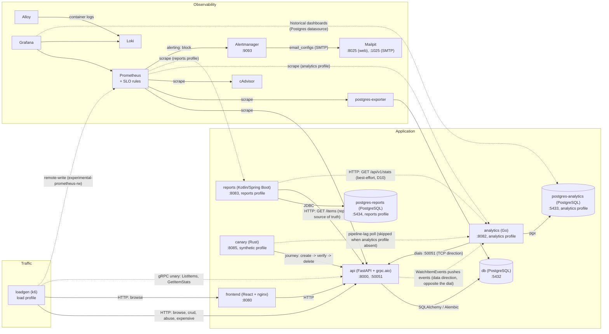

# Architecture overview

Application services plus a full observability stack, wired by Docker
Compose. Design rationale and history live in the RFCs:
[RFC-0000](rfc/0000-baseline-retrospective.md) documents this baseline;
[RFC-0001](rfc/0001-polyglot-platform.md) is the plan it evolves under.

This diagram tracks the code: a change that alters the topology updates it
in the same PR (engineering-principles.md Section 1). The `an -> be` edge
is real as of RFC-0001 Phase 3 PR-B (`feat/analytics-ingest`): analytics
dials the backend and holds one long-lived connection (connection
direction: analytics -> backend), while the backend pushes `ItemEvent`s
over it (data direction: backend -> analytics, drawn as the separate
dashed edge above) -- the two arrows point opposite ways on purpose, the
classic streaming-direction confusion RFC-0001 D3 calls out explicitly.

The `graf -> pgA` edge is the RFC-0001 D5 boundary made visible: Grafana
queries `postgres-analytics` directly via a Postgres datasource for
historical/business-data dashboards (`Analytics History`,
`docs/observability.md`), separate from the `prom -> an` scrape edge
above -- Prometheus panels show data only since the stack last started,
while this edge is durable business history (RFC-0001 Phase 5 PR-2).

The gRPC client owns all reconnect logic (ADR-0002): on (re)connect it
pulls a `ListItems` snapshot, reconciles it into `current_items`, then
resumes the event stream; a connection lost while the client is down
means those events are gone (at-most-once transport), which is the
motivating exhibit for the NATS capstone (RFC-0001 Section 10).

## Components

- **Frontend** ([readme](../services/frontend/README.md)) -- React + Vite
  CRUD UI, Web Vitals reporting, nginx for static hosting in production.
- **Backend** ([readme](../services/backend/README.md)) -- FastAPI
  (async), SQLAlchemy + asyncpg, Pydantic validation, Alembic migrations,
  Prometheus client. Also serves `devopsdemo.items.v1.ItemService` over
  `grpc.aio` on `:50051` (RFC-0001 D3, ADR-0002) -- backend serves,
  analytics dials and consumes the `WatchItemEvents` stream (see
  Analytics below).
- **Database** -- PostgreSQL; migrations applied on api startup;
  healthchecked.
- **Analytics** ([readme](../services/analytics/README.md)) -- Go
  service, own Postgres instance (`postgres-analytics`, ADR-0005),
  hand-rolled embedded-SQL migrations applied at startup. `analytics`
  compose profile (opt-in via `make up-full` or `--profile analytics`).
  HTTP surface (`/healthz`, `/readyz` DB-only, `/metrics`), structured
  JSON logs, OpenTelemetry (no exporter yet). Ships the gRPC ingest
  client (RFC-0001 Phase 3 PR-B, ADR-0002): dials the backend's
  `ItemService`, reconciles a `ListItems` snapshot into `current_items`,
  then consumes the `WatchItemEvents` stream into `item_events` (raw) and
  `event_buckets` (hourly, event-time keyed) -- reconnecting with
  backoff+jitter on any error. Read API: `GET /api/v1/items/{item_id}`
  (the canary v2 pipeline-lag step polls it), `GET /api/v1/stats`, and
  `GET /api/v1/seed-marker`. A retention job deletes raw `item_events`
  older than `ANALYTICS_RETENTION_DAYS` (default 7) -- once immediately
  at startup, then on a ticker -- keyed on event time (RFC-0001 D7,
  ADR-0005); `event_buckets` is already the aggregate and is left
  untouched. The `analytics seed` subcommand is real (RFC-0001 Phase 5
  D5, ADR-0003): deterministic per-event historical backfill through the
  same ingestion path, driven by the shared `loadprofile/profile.json`
  shape function, `make seed-history` to run it. On success it also
  writes Grafana annotations for the 3 seeded story anomalies (Phase 5
  PR-2, see `services/analytics/README.md`) -- best-effort, does not fail
  the seed run if Grafana is unreachable.
- **Canary** ([readme](../services/canary/README.md)) -- Rust synthetic
  layer (RFC-0001 D9, ADR-0007); v2 adds a pipeline-lag step polling
  analytics, tolerating it being absent (ADR-0008 D10 graceful
  degradation). `synthetic` compose profile.
- **Reports** ([readme](../services/reports/README.md)) -- Kotlin /
  Spring Boot 3 service, the JVM showcase (RFC-0001 D2), own Postgres
  instance (`postgres-reports`) and a named artifact volume. `reports`
  compose profile (opt-in via `make up-full` or `--profile reports`); the
  largest RAM increment of any profile. As of RFC-0001 Phase 6 PR-2 the
  report engine is real: `POST /reports` accepts an async job (report type +
  `xlsx`/`pdf`/`csv`), returns `202` with a `Location`, and the job runs
  off-thread on a bounded coroutine dispatcher; `GET /reports/{id}` reports
  status (`PENDING`/`RUNNING`/`SUCCEEDED`/`FAILED`) and
  `GET /reports/{id}/download` streams the artifact. The one concrete report
  ("items summary") pulls items from the backend REST `/items` (source of
  truth, the `rep -> be` edge above) and enriches them with analytics
  aggregates from the analytics read API (best-effort, the dashed
  `rep -.-> an` edge); if analytics is absent the report still succeeds on
  backend data with a distinct "unavailable" marker (RFC-0001 D10, Hard rule
  9). Job metadata lives in `postgres-reports` (Flyway migrations); generated
  artifacts land on the named volume, never as BLOBs in the DB (RFC-0001 D2).
  The bursty Apache POI / OpenPDF allocation is the deliberate workload that
  makes the GC sawtooth visible on the `Reports JVM` dashboard -- the reason
  this service exists. Also ships the D6 uniform contract (`/healthz`,
  `/readyz` reflecting Postgres, `/metrics` including custom report-job
  meters), structured JSON logs with `trace_id`/`span_id` (D11), and
  OpenTelemetry (no exporter yet). The `loadgen -> reports` report-trigger
  edge and the canary v3 report step are PR-3, so they are deliberately
  absent from the diagram above (a diagram that shows what the code does not
  do is a bug, engineering-principles.md Section 1).
- **Loadgen** ([readme](../loadgen/README.md)) -- k6, shaped continuous
  load (RFC-0001 D4, ADR-0006). `load` compose profile (opt-in via
  `make up-full` or `--profile load`); depends only on `api` being
  started (D10 graceful degradation, same as analytics/canary above).
  Five `ramping-arrival-rate` scenarios, all weighted shares of the one
  shared load profile (`loadprofile/`, RFC-0001 D5): browse (REST +
  frontend), CRUD (create -> delete, `loadgen-` prefixed), abuse
  (intentional 4xx, marked expected so they do not pollute
  `http_req_failed`), gRPC (unary `ListItems`/`GetItemStats`), and an
  occasional concurrent-burst "expensive" scenario. Pushes every k6
  metric to Prometheus via the built-in `-o experimental-prometheus-rw`
  output. `make incident` / `make heal` run a separate one-shot script
  (`loadgen/scenarios/incident.js`) that spikes offered load or error
  rate on demand, under a fixed container name so `heal` can stop it
  from any terminal.
- **Observability** -- Prometheus (+ SLO rules), Grafana (provisioned
  dashboards, including the `Analytics History` dashboard over a
  dedicated Postgres datasource, RFC-0001 Phase 5 PR-2), Loki + Grafana
  Alloy (logs), postgres-exporter, cAdvisor, Alertmanager
  (routing/grouping/inhibition, RFC-0001 Section 7) + Mailpit (visible
  receiver). Details: [observability.md](observability.md).
- **Infrastructure** -- Docker Compose (`deploy/compose/`), multi-stage
  Dockerfiles, healthchecks, isolated network. Runtime versions are pinned
  (`.mise.toml` for toolchains, digests for images).

## Technology stack

| Component          | Technology    |
|--------------------|---------------|
| Backend runtime    | Python        |
| Web framework      | FastAPI       |
| ORM                | SQLAlchemy    |
| Database           | PostgreSQL    |
| Frontend framework | React         |
| Build tool         | Vite          |
| Analytics runtime  | Go            |
| Analytics DB driver| pgx           |
| Reports runtime    | Kotlin / JVM  |
| Reports framework  | Spring Boot 3 |
| Reports build tool | Gradle        |
| Metrics            | Prometheus    |
| Visualization      | Grafana       |
| Logs               | Loki          |
| Log collector      | Grafana Alloy |

## Further reading

- [FastAPI](https://fastapi.tiangolo.com/),
  [SQLAlchemy](https://docs.sqlalchemy.org/),
  [Alembic](https://alembic.sqlalchemy.org/),
  [Pydantic](https://docs.pydantic.dev/)
- [React](https://react.dev/), [Vite](https://vitejs.dev/)
- [Go](https://go.dev/doc/), [pgx](https://pkg.go.dev/github.com/jackc/pgx/v5)
- [Prometheus](https://prometheus.io/docs/),
  [Grafana](https://grafana.com/docs/),
  [Loki](https://grafana.com/docs/loki/latest/),
  [Alloy](https://grafana.com/docs/alloy/latest/)
- [Docker](https://docs.docker.com/),
  [Compose](https://docs.docker.com/compose/),
  [PostgreSQL](https://www.postgresql.org/docs/)
