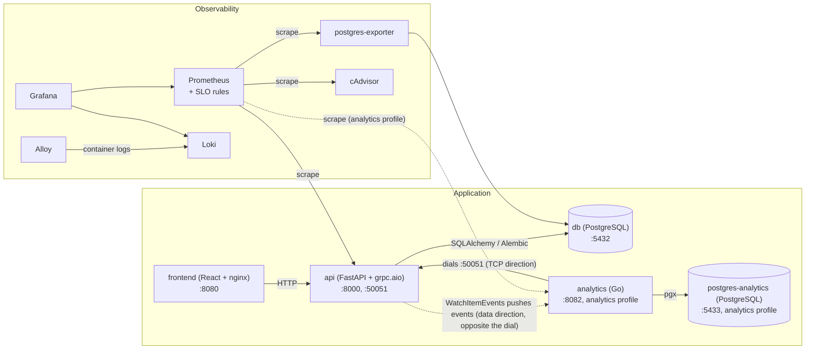

# Architecture overview

Two application services plus a full observability stack, wired by Docker
Compose. Design rationale and history live in the RFCs:
[RFC-0000](rfc/0000-baseline-retrospective.md) documents this baseline;
[RFC-0001](rfc/0001-polyglot-platform.md) is the plan it evolves under.

This diagram tracks the code: a change that alters the topology updates it
in the same PR (engineering-principles.md Section 1). The `an -> be` edge
is real as of RFC-0001 Phase 3 PR-B (`feat/analytics-ingest`): analytics
dials the backend and holds one long-lived connection (connection
direction: analytics -> backend), while the backend pushes `ItemEvent`s
over it (data direction: backend -> analytics, drawn as the separate
dashed edge above) -- the two arrows point opposite ways on purpose, the
classic streaming-direction confusion RFC-0001 D3 calls out explicitly.

The gRPC client owns all reconnect logic (ADR-0002): on (re)connect it
pulls a `ListItems` snapshot, reconciles it into `current_items`, then
resumes the event stream; a connection lost while the client is down
means those events are gone (at-most-once transport), which is the
motivating exhibit for the NATS capstone (RFC-0001 Section 10).

## Components

- **Frontend** ([readme](../services/frontend/README.md)) -- React + Vite
  CRUD UI, Web Vitals reporting, nginx for static hosting in production.
- **Backend** ([readme](../services/backend/README.md)) -- FastAPI
  (async), SQLAlchemy + asyncpg, Pydantic validation, Alembic migrations,
  Prometheus client. Also serves `devopsdemo.items.v1.ItemService` over
  `grpc.aio` on `:50051` (RFC-0001 D3, ADR-0002) -- backend serves,
  analytics dials and consumes the `WatchItemEvents` stream (see
  Analytics below).
- **Database** -- PostgreSQL; migrations applied on api startup;
  healthchecked.
- **Analytics** ([readme](../services/analytics/README.md)) -- Go
  service, own Postgres instance (`postgres-analytics`, ADR-0005),
  hand-rolled embedded-SQL migrations applied at startup. `analytics`
  compose profile (opt-in via `make up-full` or `--profile analytics`).
  HTTP surface (`/healthz`, `/readyz` DB-only, `/metrics`), structured
  JSON logs, OpenTelemetry (no exporter yet). Ships the gRPC ingest
  client (RFC-0001 Phase 3 PR-B, ADR-0002): dials the backend's
  `ItemService`, reconciles a `ListItems` snapshot into `current_items`,
  then consumes the `WatchItemEvents` stream into `item_events` (raw) and
  `event_buckets` (hourly, event-time keyed) -- reconnecting with
  backoff+jitter on any error. Read API: `GET /api/v1/items/{item_id}`
  (the canary v2 pipeline-lag step polls it) and `GET /api/v1/stats`.
  A retention job deletes raw `item_events` older than
  `ANALYTICS_RETENTION_DAYS` (default 7) -- once immediately at startup,
  then on a ticker -- keyed on event time (RFC-0001 D7, ADR-0005);
  `event_buckets` is already the aggregate and is left untouched.
- **Observability** -- Prometheus (+ SLO rules), Grafana (provisioned
  dashboards), Loki + Grafana Alloy (logs), postgres-exporter, cAdvisor.
  Details: [observability.md](observability.md).
- **Infrastructure** -- Docker Compose (`deploy/compose/`), multi-stage
  Dockerfiles, healthchecks, isolated network. Runtime versions are pinned
  (`.mise.toml` for toolchains, digests for images).

## Technology stack

| Component          | Technology    |
|--------------------|---------------|
| Backend runtime    | Python        |
| Web framework      | FastAPI       |
| ORM                | SQLAlchemy    |
| Database           | PostgreSQL    |
| Frontend framework | React         |
| Build tool         | Vite          |
| Analytics runtime  | Go            |
| Analytics DB driver| pgx           |
| Metrics            | Prometheus    |
| Visualization      | Grafana       |
| Logs               | Loki          |
| Log collector      | Grafana Alloy |

## Further reading

- [FastAPI](https://fastapi.tiangolo.com/),
  [SQLAlchemy](https://docs.sqlalchemy.org/),
  [Alembic](https://alembic.sqlalchemy.org/),
  [Pydantic](https://docs.pydantic.dev/)
- [React](https://react.dev/), [Vite](https://vitejs.dev/)
- [Go](https://go.dev/doc/), [pgx](https://pkg.go.dev/github.com/jackc/pgx/v5)
- [Prometheus](https://prometheus.io/docs/),
  [Grafana](https://grafana.com/docs/),
  [Loki](https://grafana.com/docs/loki/latest/),
  [Alloy](https://grafana.com/docs/alloy/latest/)
- [Docker](https://docs.docker.com/),
  [Compose](https://docs.docker.com/compose/),
  [PostgreSQL](https://www.postgresql.org/docs/)
