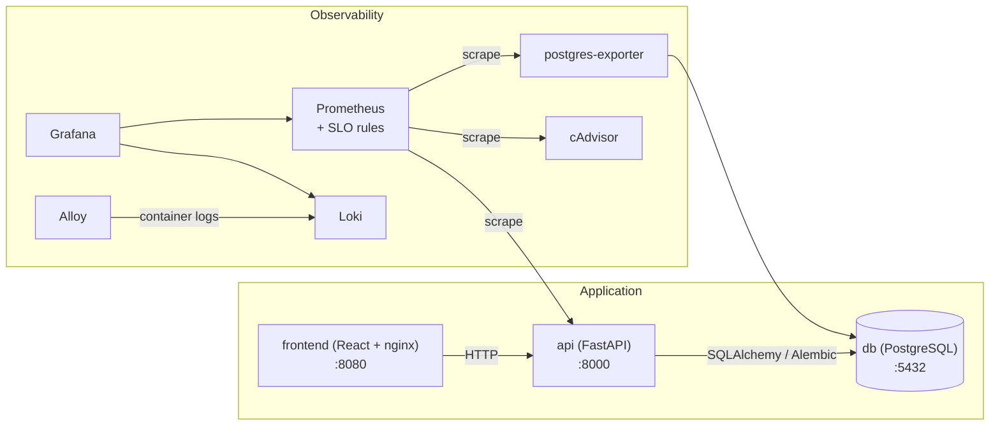

# Architecture overview

Two application services plus a full observability stack, wired by Docker
Compose. Design rationale and history live in the RFCs:
[RFC-0000](rfc/0000-baseline-retrospective.md) documents this baseline;
[RFC-0001](rfc/0001-polyglot-platform.md) is the plan it evolves under.

This diagram tracks the code: a change that alters the topology updates it
in the same PR (engineering-principles.md Section 1).

## Components

- **Frontend** ([readme](../services/frontend/README.md)) -- React + Vite
  CRUD UI, Web Vitals reporting, nginx for static hosting in production.
- **Backend** -- FastAPI (async), SQLAlchemy + asyncpg, Pydantic
  validation, Alembic migrations, Prometheus client.
- **Database** -- PostgreSQL; migrations applied on api startup;
  healthchecked.
- **Observability** -- Prometheus (+ SLO rules), Grafana (provisioned
  dashboards), Loki + Grafana Alloy (logs), postgres-exporter, cAdvisor.
  Details: [observability.md](observability.md).
- **Infrastructure** -- Docker Compose (`deploy/compose/`), multi-stage
  Dockerfiles, healthchecks, isolated network. Runtime versions are pinned
  (`.mise.toml` for toolchains, digests for images).

## Technology stack

| Component          | Technology    |
|--------------------|---------------|
| Backend runtime    | Python        |
| Web framework      | FastAPI       |
| ORM                | SQLAlchemy    |
| Database           | PostgreSQL    |
| Frontend framework | React         |
| Build tool         | Vite          |
| Metrics            | Prometheus    |
| Visualization      | Grafana       |
| Logs               | Loki          |
| Log collector      | Grafana Alloy |

## Further reading

- [FastAPI](https://fastapi.tiangolo.com/),
  [SQLAlchemy](https://docs.sqlalchemy.org/),
  [Alembic](https://alembic.sqlalchemy.org/),
  [Pydantic](https://docs.pydantic.dev/)
- [React](https://react.dev/), [Vite](https://vitejs.dev/)
- [Prometheus](https://prometheus.io/docs/),
  [Grafana](https://grafana.com/docs/),
  [Loki](https://grafana.com/docs/loki/latest/),
  [Alloy](https://grafana.com/docs/alloy/latest/)
- [Docker](https://docs.docker.com/),
  [Compose](https://docs.docker.com/compose/),
  [PostgreSQL](https://www.postgresql.org/docs/)
