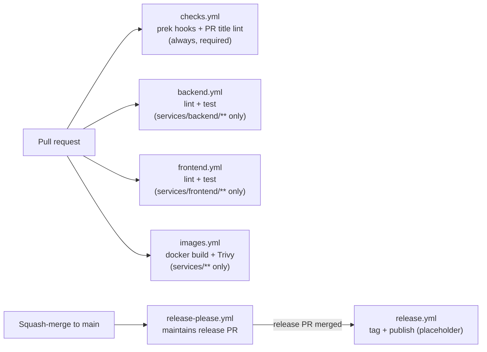

# CI/CD architecture

How the pipeline is built and why -- the reviewable form of RFC-0001 D12/D13/D14.
Principle: **CI runs what you run** (`make ci` executes locally exactly what the
pipeline runs; divergence between the two is a bug, see
engineering-principles.md Section 6).

## Topology

Path-filtered per-module workflows plus cross-cutting gates that always run:

| Workflow           | Triggers on                        | Jobs                                            |
|--------------------|------------------------------------|-------------------------------------------------|
| checks.yml         | every PR, push to main             | prek hooks (all files), PR title commitlint     |
| backend.yml        | services/backend/** changes        | ruff + mypy, pytest against real Postgres       |
| frontend.yml       | services/frontend/** changes       | eslint, vitest                                  |
| images.yml         | services/**, deploy/compose/**     | docker build + Trivy scan per service (matrix)  |
| release-please.yml | push to main                       | maintain release PR from commit history         |
| release.yml        | release published                  | placeholder (image publishing comes later)      |

New services add their own path-filtered workflow in the phase that adds the
service -- "has CI" is part of the Definition of Done
(engineering-principles.md Section 6).

## Local parity: make ci

`make ci` runs hooks + lint + tests -- the same make targets the workflows
call (`lint-backend`, `type-check`, `lint-frontend`, `test-backend`,
`test-frontend`, `lint-infra`). CI is the same commands with per-job caching
and a real Postgres service container.

Git hooks are the first, fastest gate: **prek** (pre-commit-compatible,
single binary) runs formatting, docs linting, and secret scanning before the
push, and `j178/prek-action` runs the *same tool and config* as the
first-stage CI job. Hooks are not mirrored between local and CI -- they are
literally the same thing in both places. Classic pre-commit remains the
documented fallback (`pip install pre-commit`; the config file is
compatible).

## Gates

- **Hooks (prek):** whitespace/EOF, YAML/JSON/TOML validity, compose config
  validation, hadolint, Makefile check, markdownlint, shellcheck/shfmt,
  yamllint, ASCII-only docs linter (pygrep hook; box-drawing characters
  are tolerated anywhere in Markdown, reviewers keep them to directory
  trees), gitleaks secret scanning.
- **PR title commitlint:** squash-merge repo -- PR titles become the commit
  history release-please reads, so titles are linted as Conventional
  Commits, not branch commits.
- **Trivy image scan:** every service image is built and scanned on change,
  plus a weekly scheduled rescan -- new CVEs appear without commits; a
  critical, fixable CVE fails the pipeline (RFC-0001 D13).
- **Secret scanning, two layers:** gitleaks runs in the hooks (working
  tree, every commit) and as a weekly full-git-history scan in CI -- a
  secret committed and later removed is invisible to the hook layer.
- **Planned (later phases):** `buf lint` + `buf breaking` on proto/,
  load-profile parity test, compose e2e stage with k6 thresholds, nightly
  full-profile workflow, per-service dependency audits.

## Releases

- **release-please** (repo-level single version, `release-type: simple`)
  maintains a release PR: version bump + changelog assembled from
  Conventional Commit history. Humans review releases; they do not assemble
  them.
- Merging the release PR tags `vX.Y.Z` and publishes a GitHub Release;
  image build + GHCR publishing lands in a later phase (release.yml is a
  placeholder until then).
- Version math is only as good as the history it reads -- hence squash-merge
  only and the PR title lint.
- Caveat: with the default `GITHUB_TOKEN`, CI does not run on the release
  PR (GitHub prevents workflow recursion). Configure the `PR_PAT_TOKEN`
  secret (a PAT with repo scope) to lift this; release-please.yml prefers
  it when present.

## Dependency updates

**Renovate** (`.github/renovate.json5`): grouped weekly updates across all
ecosystems (pip, npm, GitHub Actions, Dockerfiles, compose images,
pre-commit hook versions), semantic commit titles, digest pinning for base
images and actions. Chosen over Dependabot for grouping and monorepo
awareness (RFC-0001 D12); Dependabot remains the documented fallback if
self-hosting becomes a burden.

Renovate runs **self-hosted** in GitHub Actions
(`.github/workflows/renovate.yml`, weekly cron + manual dispatch) rather
than via the hosted Mend app -- the automation stays in the repository as
code. Prerequisite: the `PR_PAT_TOKEN` secret (PAT with repo scope), also
used by release-please.

## Branch protection (settings as documentation)

GitHub repository settings expected by this pipeline -- kept here because
settings are not otherwise reviewable:

- **Squash-merge only** (merge commits and rebase-merge disabled); default
  squash message = PR title. Linear history required.
- **Required status checks** on main: `Git hooks (prek)`,
  `PR title (Conventional Commits)`.
- Per-module checks (backend, frontend, images) are intentionally **not**
  required: a workflow skipped by its path filter leaves required checks
  pending forever, blocking docs-only PRs. Reviewers treat a red module
  check as blocking; the required cross-cutting gates catch the rest.
- At least one approving review; conversation resolution before merge.

## Caching

Per-ecosystem caches keyed by lockfiles: pip (`setup-python` cache) and npm
(`setup-node` cache) today; cargo, Go, and Gradle caches arrive with their
services. Five ecosystems in one repo make cache strategy a first-class
exhibit -- this section grows with each phase.
