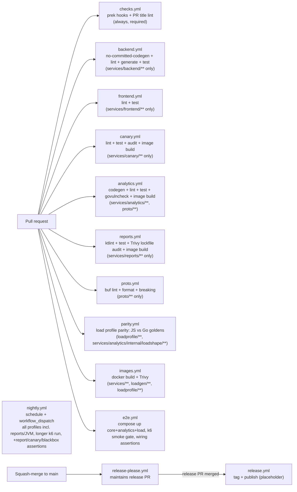

# CI/CD architecture

How the pipeline is built and why -- the reviewable form of RFC-0001 D12/D13/D14.
Principle: **CI runs what you run** (`make ci` executes locally exactly what the
pipeline runs; divergence between the two is a bug, see
engineering-principles.md Section 6).

## Topology

Path-filtered per-module workflows plus cross-cutting gates that always run:

| Workflow           | Triggers on                                                                  | Jobs                                                                                                  |
|--------------------|------------------------------------------------------------------------------|-------------------------------------------------------------------------------------------------------|
| checks.yml         | every PR, push to main                                                       | prek hooks (all files), PR title commitlint                                                           |
| backend.yml        | services/backend/** changes                                                  | no-committed-codegen check, ruff + mypy, `make generate` + pytest against real Postgres               |
| frontend.yml       | services/frontend/** changes                                                 | eslint, vitest                                                                                        |
| canary.yml         | services/canary/** changes                                                   | fmt + clippy, cargo test, cargo-deny, image                                                           |
| analytics.yml      | services/analytics/**, proto/** changes                                      | no-committed-codegen check, buf generate + lint + test (Postgres container), govulncheck, image       |
| reports.yml        | services/reports/** changes                                                  | ktlint, test (Testcontainers Postgres), Trivy gradle.lockfile audit, image                            |
| proto.yml          | proto/** changes                                                             | buf lint + format, buf breaking (against main)                                                        |
| parity.yml         | loadprofile/**, services/analytics/internal/loadshape/**                     | JS (shape.js) vs Go (loadshape) parity against checked-in goldens (Hard rule 8)                       |
| images.yml         | services/**, deploy/compose/**, loadgen/**, loadprofile/**                   | docker build + Trivy scan per service (matrix, includes loadgen)                                      |
| e2e.yml            | services/**, deploy/compose/**, observability/**, loadgen/**, loadprofile/** | `make smoke`: compose up core+analytics+load (`--wait`), k6 smoke gate, wiring assertions (see below) |
| nightly.yml        | schedule (daily) + workflow_dispatch                                         | `make smoke-full`: same gate + reports/JVM profile, longer run, +report/canary/blackbox assertions    |
| release-please.yml | push to main                                                                 | maintain release PR from commit history                                                               |
| release.yml        | release published                                                            | placeholder (image publishing comes later)                                                            |

New services add their own path-filtered workflow in the phase that adds the
service -- "has CI" is part of the Definition of Done
(engineering-principles.md Section 6).

## Local parity: make ci

`make ci` runs hooks + lint + tests -- the same make targets the workflows
call (`lint-backend`, `type-check`, `lint-frontend`, `test-backend`,
`test-frontend`, `lint-canary`, `test-canary`, `lint-analytics`,
`test-analytics`, `lint-reports`, `test-reports`, `lint-infra`). CI is the
same commands with per-job caching and a real Postgres service container.

Git hooks are the first, fastest gate: **prek** (pre-commit-compatible,
single binary) runs formatting, docs linting, and secret scanning before the
push, and `j178/prek-action` runs the *same tool and config* as the
first-stage CI job. Hooks are not mirrored between local and CI -- they are
literally the same thing in both places. Classic pre-commit remains the
documented fallback (`pip install pre-commit`; the config file is
compatible).

## Gates

- **Hooks (prek):** whitespace/EOF, YAML/JSON/TOML validity, compose config
  validation, hadolint, Makefile check, markdownlint, shellcheck/shfmt,
  yamllint, ASCII-only docs linter (pygrep hook; box-drawing characters
  are tolerated anywhere in Markdown, reviewers keep them to directory
  trees), gitleaks secret scanning.
- **PR title commitlint:** squash-merge repo -- PR titles become the commit
  history release-please reads, so titles are linted as Conventional
  Commits, not branch commits.
- **Trivy image scan:** every service image is built and scanned on change,
  plus a weekly scheduled rescan -- new CVEs appear without commits; a
  critical, fixable CVE fails the pipeline (RFC-0001 D13).
- **Secret scanning, two layers:** gitleaks runs in the hooks (working
  tree, every commit) and as a weekly full-git-history scan in CI -- a
  secret committed and later removed is invisible to the hook layer.
- **Per-service dependency audit:** `cargo-deny` (advisories, license
  allow-list, banned/duplicate dependency policy, source allow-list) for
  the canary; `govulncheck` (known-vulnerability scan against the module
  and stdlib) for analytics. Reports uses a Trivy filesystem scan of its
  committed `gradle.lockfile` rather than a native scanner: the JVM has no
  reliable offline-capable govulncheck analog (OWASP dependency-check needs
  a slow, flaky NVD feed), and this repo already standardizes on Trivy for
  CVEs (RFC-0001 D13, ADR-0011) -- the same CRITICAL gate the image scan
  uses, no external key. The lockfile (Gradle dependency locking) is scanned
  rather than the boot jar because Trivy's filesystem jar analyzer does not
  descend a Spring Boot executable jar's `BOOT-INF/lib`; the lockfile is the
  reproducible, transitive-complete dependency inventory. `pip-audit` for the
  backend remains a possible later addition (RFC-0001 D6).
- **No committed generated code (backend, analytics):** a `git ls-files`
  check against each service's generate-in-build gRPC stub directory
  (`services/backend/app/proto_gen`, `services/analytics/internal/pb`)
  fails the pipeline if anything under it is currently tracked by git
  (RFC-0001 D8, ADR-0002 -- Hard rule 1). `make generate`/`buf generate`
  then runs before tests, since both services import the generated stubs
  at load/compile time.
- **buf lint + format + breaking (proto/):** `bufbuild/buf-action` runs
  `buf lint` and `buf format --diff` on every proto/ change, plus
  `buf breaking` against the `main` branch baseline on pull requests
  (RFC-0001 D3/D12, ADR-0002). Baseline guard: `main` has no `proto/`
  module until this gate's own PR merges, and `buf breaking` against a ref
  where the module path does not exist errors rather than skips -- a shell
  step checks `git ls-tree origin/main -- proto` first and skips the
  breaking step cleanly when absent. The guard becomes a permanent no-op
  once `proto/` exists on `main` (every later PR sees it).
- **Load profile parity (`loadprofile/**`,
  `services/analytics/internal/loadshape/**`):** the
  seam invariant (Hard rule 8, RFC-0001 D5, ADR-0003) is enforced in CI,
  not eyeballed -- `parity.yml` recomputes a fixed golden grid with both
  the JS (`loadprofile/shape.js`) and Go
  (`services/analytics/internal/loadshape`) implementations and compares
  against checked-in goldens: Go exactly (it is the canonical generator),
  JS within a `1e-9` relative tolerance (cross-language `cos` ULP
  drift -- the formula's only transcendental). See
  `loadprofile/README.md` for the scale and noise
  determinism contract both implementations must keep identical.
- **e2e stage (`e2e.yml`, PR-4):** `make smoke` -- the same command a
  developer runs locally -- brings up `core + analytics + load`
  (`docker compose ... up -d --build --wait`, time-bounded via
  `--wait-timeout`), one-shot runs the k6 smoke gate
  (`loadgen/scenarios/smoke.js`: the same exec functions and the same
  threshold contract as the long-running `loadgen/scenarios/main.js`,
  shared via `loadgen/lib/thresholds.js` so the two cannot drift), then
  asserts the pieces are actually wired together
  (`scripts/e2e-smoke.sh`: backend `/healthz`, analytics `/readyz`,
  `analytics_stream_connected == 1`, Prometheus targets `api`/`analytics`
  both `up`). The JVM (`reports`, Phase 6) stays out of this per-PR stage
  -- standard GitHub-hosted runners (7 GB) do not comfortably fit it
  alongside everything else (RFC-0001 D12 CI resource constraint); it is
  exercised in `nightly.yml` instead (see below).
  Failures print `compose ps` plus the failing service's own log tail
  (from the assertion script) and, as a coarser net, the full compose
  state (from the workflow's own `if: failure()` step); teardown
  (`--profile "*" down -v`) always runs.
- **Nightly full-profile workflow (`nightly.yml`, PR-4, Phase 6):** `make
  smoke-full` runs the identical gate on every profile the repo ships
  (`core + analytics + synthetic + reports + load`), a longer k6 run
  (`SMOKE_DURATION_SECONDS` override), and the extra assertions those
  profiles enable: canary journey success
  (`sum(canary_journey_total{result="success"}) > 0`) and blackbox
  `probe_success == 0` returning no targets (the `synthetic` profile),
  plus a reports readiness + async job check -- `POST /reports` polled to
  `SUCCEEDED` and downloaded (the `reports` JVM profile). As of Phase 6
  PR-3 this is where the JVM runs: `--profile reports` brings it up and
  the k6 `report` scenario drives it, gated by `LOADGEN_REPORTS_URL` set
  only in this target. Scheduled daily plus `workflow_dispatch`, not
  per-PR, per the same RAM constraint above.

## Releases

- **release-please** (repo-level single version, `release-type: simple`)
  maintains a release PR: version bump + changelog assembled from
  Conventional Commit history. Humans review releases; they do not assemble
  them.
- Merging the release PR tags `vX.Y.Z` and publishes a GitHub Release;
  image build + GHCR publishing lands in a later phase (release.yml is a
  placeholder until then).
- Version math is only as good as the history it reads -- hence squash-merge
  only and the PR title lint.
- Caveat: with the default `GITHUB_TOKEN`, CI does not run on the release
  PR (GitHub prevents workflow recursion). Configure the `PR_PAT_TOKEN`
  secret (a PAT with repo scope) to lift this; release-please.yml prefers
  it when present.

## Dependency updates

**Renovate** (`.github/renovate.json5`): grouped weekly updates across all
ecosystems (pip, npm, Go modules, GitHub Actions, Dockerfiles, compose
images, pre-commit hook versions), semantic commit titles, digest pinning
for base images and actions. Go (like Python) moves by patch only for the
runtime version itself -- minor/major bumps are a deliberate `.mise.toml`
change, not a dependency PR (ADR-0012). Chosen over Dependabot for grouping and monorepo
awareness (RFC-0001 D12); Dependabot remains the documented fallback if
self-hosting becomes a burden.

Renovate runs **self-hosted** in GitHub Actions
(`.github/workflows/renovate.yml`, weekly cron + manual dispatch) rather
than via the hosted Mend app -- the automation stays in the repository as
code. Prerequisite: the `PR_PAT_TOKEN` secret (PAT with repo scope), also
used by release-please.

## Branch protection (settings as documentation)

GitHub repository settings expected by this pipeline -- kept here because
settings are not otherwise reviewable:

- **Squash-merge only** (merge commits and rebase-merge disabled); default
  squash message = PR title. Linear history required.
- **Required status checks** on main: `Git hooks (prek)`,
  `PR title (Conventional Commits)`.
- Per-module checks (backend, frontend, images, e2e) are intentionally
  **not** required: a workflow skipped by its path filter leaves required
  checks pending forever, blocking docs-only PRs -- e2e.yml is
  path-filtered the same way. Reviewers treat a red module check as
  blocking; the required cross-cutting gates catch the rest.
  `nightly.yml` runs on a schedule, not per-PR, so it is never a branch
  protection candidate at all.
- At least one approving review; conversation resolution before merge.

## Caching

Per-ecosystem caches keyed by lockfiles: pip (`setup-python` cache), npm
(`setup-node` cache), cargo (`Swatinem/rust-cache`, keyed on
`services/canary/Cargo.lock`), Go (`actions/setup-go`'s built-in cache,
keyed on `services/analytics/go.sum`), and -- the fifth ecosystem, added
with reports -- Gradle (`gradle/actions/setup-gradle`, which caches the
dependency downloads and build outputs keyed on the build scripts and the
committed wrapper). Five language ecosystems in one repo (pip, npm, cargo,
Go modules, Gradle) make cache strategy a first-class exhibit -- each
`setup-*` action owns its own ecosystem's cache, no hand-rolled cache keys.
