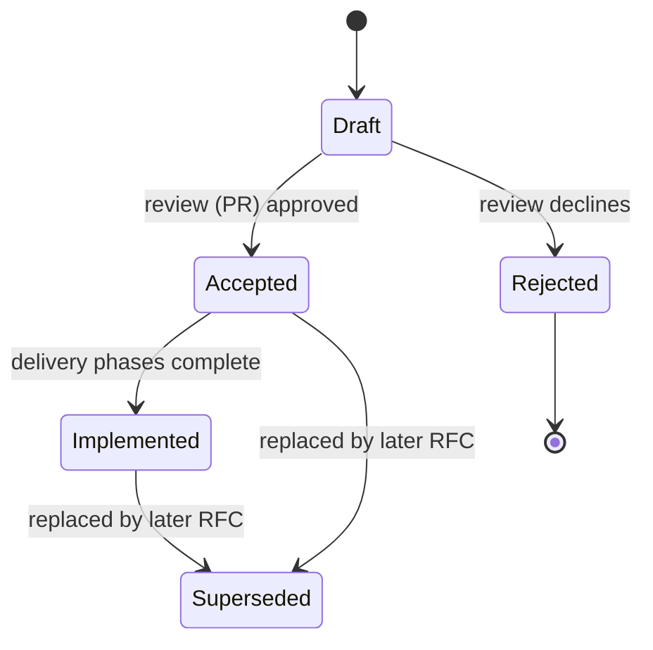

# Engineering Principles

How we build and evolve `devops-demo` -- and why. This document is aimed at
students and contributors: the *process* here is as much part of the curriculum
as the code. Everything below is practiced in this repo, not just preached.

## 1. Core principles

- **Decisions are written down.** If a choice will outlive the pull request that
  introduced it, it gets a document (RFC or ADR). Code shows *what*; documents
  preserve *why*. Six months later, "why is there a third Postgres?" must be
  answerable without archaeology.
- **Contract first.** Interfaces between modules (proto files, the load-profile
  schema, the uniform service contract) are designed and reviewed before the
  implementations that depend on them.
- **Everything is code.** Dashboards, alerts, seed data, load scenarios, CI
  gates, and documentation live in the repository, versioned and reviewed like
  any other change. Nothing important lives only in a UI.
- **Diagrams are code too.** Architecture, sequence, and state diagrams are
  written in Mermaid inside the Markdown documents (GitHub renders them
  natively), so they are diffable and reviewed with the change they describe.
  A diagram that contradicts the code is a bug -- fix it in the same PR.
  Exception: directory trees stay as plain-text blocks -- graphs are the wrong
  tool for file trees. Keep diagrams simple enough to review as text.
- **Docs are ASCII-only.** Plain ASCII punctuation in all documentation:
  `--` instead of em dashes, `->` instead of arrow glyphs, `x` for
  multiplication, "Section N" instead of the section sign. Rationale: clean
  diffs, no encoding surprises across editors/terminals/grep, and trivially
  typeable review suggestions. Reasonable exceptions: box-drawing characters
  inside directory-tree blocks, and non-ASCII content that is itself the
  subject (e.g. i18n test fixtures). CI may enforce this with a simple
  non-ASCII linter that whitelists tree blocks.
- **One instruction file for all AI agents.** Agent guidance lives in a
  single canonical `AGENTS.md` (the open standard read natively by modern
  coding agents); no tool-specific files (`CLAUDE.md`,
  `.github/copilot-instructions.md`) -- one file cannot drift between
  tools, the same DRY principle we apply to code. Nested `AGENTS.md`
  files in service
  directories add module-specific guidance. Keep it terse: agents load it
  every session, so it is a token budget. Internal structure: one numbered
  Hard rules list is the single statement of every rule; other sections
  reference rules by number, never restate them. Across files: the rule
  itself stays inline (a reference an agent must fetch is a reference an
  agent may skip); the rationale is a section-level pointer
  ("file.md Section N").
- **Make the invisible visible.** Every architectural property we claim must be
  observable on a dashboard: GC behavior, pipeline lag, load shape, error
  budgets. If you can't see it, you can't teach it -- or operate it.
- **Honest about trade-offs.** When we choose a known limitation (e.g.
  at-most-once event streaming), we document it, build the monitoring that
  exposes it, and plan the fix as a future phase -- we do not hide it.
- **Boring where possible, novel where it teaches.** Standard tools for
  standard jobs (blackbox_exporter, k6, buf). Custom code only where it carries
  a lesson (the synthetic canary, the analytics service).
- **Small, reviewable steps.** Phased delivery; every phase independently
  demoable; mechanical changes (renames, moves) separated from logic changes.

## 2. RFCs -- Request for Comments

**When:** a change that spans multiple modules, introduces a new service or
cross-cutting contract, or meaningfully changes architecture. Rule of thumb:
if it needs a delivery plan, it's an RFC.

**What it contains:** context and motivation, goals and explicit non-goals,
the proposed design, alternatives considered *with reasons for rejection*,
risks and mitigations, a phased delivery plan, and open questions.

**Lifecycle:**



- RFCs live in `docs/rfc/`, numbered sequentially (`0001-short-title.md`).
- Review happens in the pull request that adds the RFC. Discussion threads on
  the PR are the "comments" in Request for Comments.
- Open questions are tracked in the RFC itself and converted to a resolution
  log when answered -- decisions and their dates stay visible.
- An accepted RFC is a *plan*, not a contract carved in stone: implementation
  learnings feed back as amendments (small) or a superseding RFC (large).
- **Retrospective RFCs** are legitimate: when a system predates the process,
  we document it as-built (see RFC-0000) so the baseline is reasoned about,
  not merely inherited.

## 3. ADRs -- Architecture Decision Records

**When:** one significant, long-lived decision -- a technology choice, a
contract, a convention. If an RFC is a chapter, an ADR is a sentence you will
quote for years.

**Format (kept short -- one page):**

```markdown
# ADR-NNNN: Title
- Status: Proposed | Accepted | Deprecated | Superseded by ADR-XXXX
- Date:
- Context:      what forces are at play, what problem we are solving
- Decision:     what we chose, stated in one or two sentences
- Alternatives: what else was considered and why it lost
- Consequences: what becomes easier, what becomes harder, what we accept
```

- ADRs live in `docs/adr/`, numbered sequentially, **immutable once accepted**:
  changing a decision means a *new* ADR that supersedes the old one. The chain
  of superseded ADRs is the history of our thinking -- never rewrite it.
- Large RFCs spawn ADRs for their durable decisions (see RFC-0001 Section 12); the
  RFC narrates, the ADRs endure.

## 4. Change workflow

- **Trunk-based:** short-lived branches off `main`, merged via pull request.
  No long-running feature branches.
- **Every PR:** small enough to review in one sitting; green CI; description
  says *why*, links the RFC/ADR/issue it serves, and (for non-trivial
  changes) carries a "Change model" section: affected components, touched
  invariants, assumptions, plan -- Model-First Reasoning made reviewable.
  The PR template prompts for it; reviewers read the model before the diff.
  Applies to humans and AI agents alike (see `AGENTS.md`).
- **Conventional Commits** (`feat:`, `fix:`, `docs:`, `refactor:`, `chore:`,
  with optional scope, e.g. `feat(analytics): event-time bucketing`).
- **Mechanical vs logic changes never mix.** A rename/move PR contains zero
  behavior changes; reviewers can then trust `git mv` diffs at a glance.
- **Review culture:** reviews critique the code, never the person. Questions
  are contributions ("why not X?" is welcome and often becomes an ADR
  alternative). Author merges after approval; nit-level comments may be
  resolved without another round-trip.
- **Escalating disagreement: write, don't argue.** Rule of thumb: when a
  review thread reaches ~3 back-and-forth rounds without converging, stop
  replying. One party (usually the PR author) writes a short proposal
  instead -- half a page, typically a draft ADR:
  - what exactly is disputed (one sentence);
  - the 2-3 options on the table;
  - trade-offs of each, stated fairly -- you must describe the other side's
    option well enough that they would sign off on the description;
  - a recommendation and, crucially, the *deciding criterion*.

  The decision is then made on the proposal (in its PR, or one short sync)
  and recorded; the original thread gets a link and is closed.
  *Why this works:* long comment threads optimize for winning the last
  reply; a proposal forces all options into one frame, and disagreements
  often dissolve the moment the real criterion is written down. It also
  leaves a record -- a thread ending in "ok, fine" preserves nothing.
  *Example from this repo:* "commit generated gRPC Go code vs
  generate-in-build" could easily burn ten comment rounds -- both are
  defensible best practices. Instead it was framed as options with fair
  trade-offs (Go community norm + zero-toolchain builds vs guaranteed
  no-drift + hermetic Docker builds), decided on the deciding criterion
  ("does anyone import these services as Go modules?" -- no), and recorded
  in RFC-0001 D8 / ADR-0002. Total cost: half a page. The next person who
  disagrees argues with the written rationale, not with a colleague.

## 5. Definition of Done (per service)

A service change is done when it satisfies the uniform service contract
(RFC-0001 D6):

- `/healthz` + `/readyz` (and gRPC health protocol where applicable)
- `/metrics` in Prometheus format; JSON logs to stdout
- Tests pass; format/lint/audit gates green in CI
- Grafana dashboard updated if observable behavior changed
- Docs updated in the same PR -- documentation is part of the change, not a
  follow-up ticket that never happens

## 6. CI/CD principles

- **CI grows with the system, not after it.** Every phase that adds a module
  ships that module's pipeline in the same phase; "has CI" is part of the
  Definition of Done, not a hardening task for later.
- **CI runs what you run.** `make ci` executes locally the exact commands the
  pipeline runs. "Works on my machine but not in CI" (or the reverse) is a
  bug in this contract, not a fact of life.
- **Pipelines are architecture.** Path-filtered per-module workflows,
  cross-cutting contract gates (proto breaking-change checks, load-profile
  parity, docs linting), per-ecosystem caching, and one end-to-end smoke
  stage -- designed and documented (`docs/ci.md`) like any other component.
- **Releases are automated from commit history.** Conventional Commits drive
  release-please: it maintains a release PR (version bump + changelog);
  merging it tags the release, builds images, and publishes them. Humans
  review releases; they do not assemble them. Prerequisite: squash-merge
  only, PR titles linted as Conventional Commits -- version math is only as
  good as the history it reads.
- **Ship pinned, run pinned.** Images tagged with version and git SHA; base
  images pinned by digest; "deploy" means pulling a pinned release, never
  `latest`.
- **Dependencies update themselves; humans review.** Automated dependency
  PRs across all ecosystems, small and continuous, instead of a heroic
  quarterly upgrade. Tool: Renovate (Dependabot is the GitHub-native
  alternative -- simpler, weaker monorepo grouping; see RFC-0001 D12).
- **Cheap gates run before the push -- and identically in CI.** Git hooks
  (prek, pre-commit-compatible) cover the fast checks: formatting, docs
  linting, secret scanning. CI runs the *same tool and config* as a
  first-stage job (prek-action), so these checks cannot drift between local
  and CI -- the "CI runs what you run" rule holds by construction, and the
  feedback loop is seconds, not a failed pipeline.

## 7. Testing philosophy

- **Unit tests** for logic; **integration tests** against real dependencies in
  containers (not mocks of Postgres); one **end-to-end smoke** via compose + k6
  in CI.
- **Contract tests where contracts live:** `buf breaking` guards the proto;
  the golden-file parity test guards the load profile across languages.
- Performance is a test: k6 thresholds (latency, error rate) gate CI like any
  assertion.
- Deterministic by default: seeded RNG (`--seed 42`) everywhere randomness
  appears, so failures reproduce.

## 8. Observability as a first-class deliverable

- Three monitoring layers, always distinguished: **whitebox** (what a service
  says about itself), **blackbox** (whether it is reachable from outside),
  **synthetic** (whether the whole user journey works). Each catches failures
  the others cannot -- knowing which layer fired is half the diagnosis.
- Alert on symptoms (user-visible), page on urgency, dashboard the causes.
- Every incident-shaped feature (`make incident`) exists so students can watch
  detection -> alerting -> recovery live, not read about it.

## 9. Culture in one paragraph

We optimize for the reader: of the code, of the docs, of the dashboards. We
write down decisions while they are cheap to write down. We prefer a visible
limitation over a hidden hack. We treat "I don't know, let's find out" as a
professional answer, and we leave every module more understandable than we
found it.
