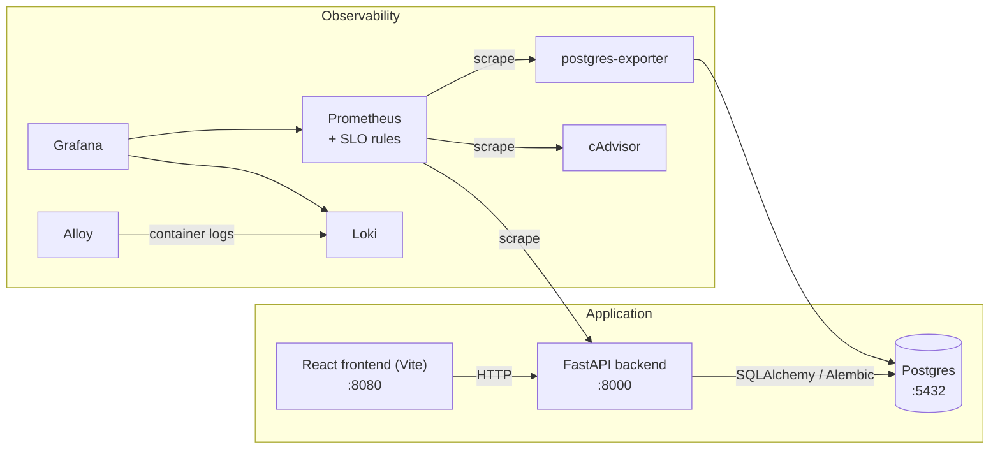

# RFC-0000: DevOps Demo baseline -- retrospective

- **Status:** Implemented (retrospective)
- **Author:** vovin
- **Created:** 2026-07-10 (documents work completed earlier)
- **Note:** This RFC is written *after* the system it describes. It exists so
  that the baseline architecture is reasoned about in writing, like everything
  that follows it (see `docs/engineering-principles.md` Section 2 on retrospective
  RFCs). Where a decision was made implicitly at the time, we reconstruct the
  rationale honestly -- including what we would reconsider today.

## 1. Summary

`devops-demo` v1 is a complete small-scale example of taking a service from
code to an operated system: a FastAPI backend with Postgres, a React frontend,
containerized with Docker Compose, covered by tests, and observable through a
full local monitoring stack (Prometheus, Grafana, Loki, Alloy, cAdvisor,
postgres-exporter) with SLO rules.

Teaching goal of v1: demonstrate that "done" means *operable* -- tested,
containerized, monitored, documented -- not merely "the endpoint returns 200".

## 2. Context

The repository was built as a learning vehicle: a system small enough to run
on a laptop and read in an evening, yet real enough to exhibit production
practices (migrations, structured observability, SLOs, make-driven workflow).
Most public demo apps show either an application *or* an observability stack;
v1 deliberately ships both, wired together.

## 3. Architecture (as built)

| Component | Choice | Role |
| ----------- | -------- | ------ |
| Backend | Python 3 / FastAPI | Items CRUD REST API, OpenAPI docs (Swagger/ReDoc) |
| Migrations | Alembic | Versioned schema changes as code |
| Frontend | React + Vite | CRUD UI |
| Database | PostgreSQL | Single relational store |
| Metrics | Prometheus (+ postgres-exporter, cAdvisor) | Service, DB, and container metrics |
| Logs | Loki + Grafana Alloy | Centralized structured logs |
| Dashboards/alerts | Grafana, provisioned from JSON; Prometheus SLO rules | Observability as code |
| Orchestration | Docker Compose + Makefile | One-command bring-up (`make up`, `make seed`) |
| Docs | `docs/` (prerequisites, local setup, testing, contributing, architecture) | Docs as part of the deliverable |

## 4. Decisions (reconstructed)

### B1. FastAPI + Postgres as the reference application

- Python/FastAPI: low barrier for students, async-native, free OpenAPI docs,
  first-class Prometheus and testing ecosystems.
- Postgres over SQLite: real migrations, a real exporter, real operational
  surface (connections, locks, WAL) worth putting on dashboards.
- Items CRUD as the domain: deliberately boring -- the domain must never
  compete with the operational lessons for attention.

### B2. Full observability stack from day one

- Prometheus + Grafana + Loki + Alloy locally, not a SaaS: students see every
  moving part, no accounts required, works offline.
- Dashboards and datasources **provisioned from files**, alerts as rule files:
  observability-as-code from the start; nothing exists only in a UI.
- SLO rules included in v1: error budgets introduced as a normal part of a
  service, not an advanced afterthought.
- cAdvisor + postgres-exporter: the lesson that *your* code is only one of
  three metric sources (app, runtime/container, dependencies).

### B3. Docker Compose + Makefile as the operational interface

- Compose over Kubernetes for v1: the orchestration lesson at this stage is
  "declared services, networks, healthchecks" -- K8s would bury it in YAML.
- Makefile as the single entry point (`make up`, `make seed`, `make help`):
  discoverable, self-documenting, CI and humans run the same commands.

### B4. Documentation as a deliverable

- `docs/` shipped with the code: prerequisites, local setup, testing,
  contributing, architecture. The contribution guide and code standards are
  part of v1, not added when contributors appear.

## 5. What v1 deliberately does not do

- No inter-service communication (single backend) -- no contracts, no RPC.
- No load: dashboards are empty until a human clicks; SLOs never burn.
- No history: every fresh start begins at zero.
- Single runtime profile (async Python) -- no GC/heap/startup diversity.
- Health endpoints and probing exist only implicitly (container healthchecks).
- No formal decision records -- this RFC retroactively closes that gap.

These gaps are not defects; they are the curriculum for the next iteration.
Each one is addressed by RFC-0001 (polyglot services, gRPC contracts, k6 load,
stitched history, three-layer monitoring, RFC/ADR process).

## 6. Retrospective assessment

**What proved right:**

- Observability-as-code from day one -- extending the stack (RFC-0001) is
  adding files, not clicking UIs.
- Boring domain -- every later lesson plugs into "items" without friction.
- Make-driven workflow -- scales cleanly to `make incident`, `make up-full`.
- Docs shipped with code -- the habit the rest of the process builds on.

**What we would reconsider knowing v2:**

- Repo layout: `backend/`/`frontend/` at root does not scale past two modules
  (fixed by RFC-0001 D8 restructure).
- No explicit `/healthz`-`/readyz` split; the uniform service contract
  (RFC-0001 D6) now formalizes it.
- Seeding (`make seed`) writes state without shape -- no time dimension;
  superseded by the profile-driven seeder (RFC-0001 D5).
- Decisions lived in commit messages and heads; RFC/ADR process now exists
  precisely because reconstructing this document required archaeology.

## 7. Relationship to later RFCs

- **RFC-0001** builds directly on this baseline: v1 backend becomes the gRPC
  source of truth; v1 observability stack absorbs new dashboards, blackbox
  probing, and load metrics; v1 compose/Make workflow grows profiles and
  incident mode.
- Nothing in v1 is discarded; everything is repositioned as the `core`
  profile (RFC-0001 D10).
