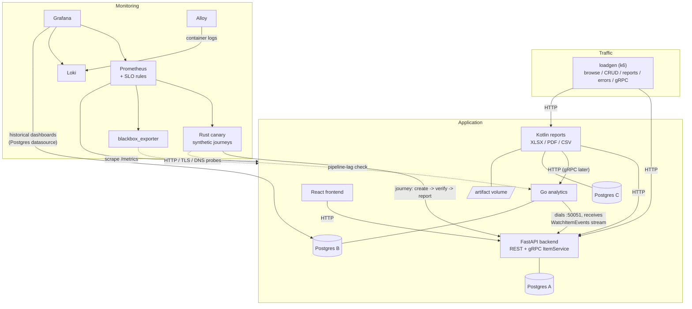

# RFC-0001: Polyglot service platform, traffic generation, and repository restructure

- **Status:** Accepted
- **Author:** vovin
- **Created:** 2026-07-10
- **Accepted:** 2026-07-12
- **Discussion:** https://github.com/vovinacci/devops-demo/pull/117

## 1. Summary

Evolve `devops-demo` from a two-service demo (FastAPI backend + React frontend) into a
polyglot, event-connected platform with five runtimes (Python, JS, Go, Rust, Kotlin/JVM),
contract-first gRPC between services, continuous shaped load generation, seamlessly
stitched historical data, and three-layer monitoring (whitebox / blackbox / synthetic) --
all under one observability roof and one uniform service contract.

Teaching goal: *same operational requirements, five runtimes*. Every addition must make an
operational difference visible on a dashboard, not just add code.

## 2. Motivation

- Current stack shows one operational profile (async Python + SPA). Real platforms mix
  runtimes with very different startup, memory, GC, and failure characteristics.
- Dashboards without traffic and history are screenshots, not a demo.
- The repo should double as a learning vehicle for students
  (JVM ops, gRPC contracts, load shaping, incident response).

## 3. Goals

- Add three services: Rust synthetic canary, Go analytics (own DB), Kotlin reports (JVM showcase).
- Add `blackbox_exporter` for standard blackbox probing (uptime, TLS, HTTP) -- use the
  industry tool for the standard job instead of reinventing it.
- Introduce contract-first Protobuf/gRPC between backend and analytics (buf-managed).
- Continuous, shaped k6 load with error traffic, incident mode, and CI thresholds.
- Deterministic historical seeding that stitches seamlessly into live traffic.
- Uniform cross-service contract (health, metrics, logs, Make targets, Dockerfile shape).
- First-class CI/CD: pipelines built per phase, `make ci` parity, automated
  releases (release-please -> GHCR), automated dependency updates.
- OpenTelemetry instrumentation and trace-context propagation from day one
  (tracing backend deferred).
- Restructure the repository so each module has one owner-language and one responsibility.

## 4. Non-goals (this RFC)

- Kubernetes manifests / Helm (compose remains the deployment target).
- Message broker (NATS) -- explicitly deferred to a capstone phase (see Section 10).
- Chaos engineering (Toxiproxy) -- noted as a future phase; topology must not preclude it.
- AuthN/AuthZ between services.
- CDC (Debezium) -- rejected as too heavy for repo size.

## 5. Target architecture



### 5.1 Service responsibilities

| Service   | Runtime                | Responsibility                                           | Data store                   |
|-----------|------------------------|----------------------------------------------------------|------------------------------|
| backend   | Python 3 / FastAPI     | Source of truth: items CRUD (REST) + gRPC `ItemService`  | Postgres A                   |
| frontend  | JS / React             | CRUD UI                                                  | --                           |
| analytics | Go                     | Event ingestion, aggregation, retention, historical seed | Postgres B                   |
| reports   | Kotlin / Spring Boot 3 | On-demand + scheduled XLSX/PDF/CSV report jobs           | Postgres C + artifact volume |
| canary    | Rust / axum + tokio    | Synthetic user journeys, E2E pipeline-lag metrics        | in-memory                    |
| loadgen   | k6 (JS)                | Shaped continuous load, error traffic, incident mode     | --                           |

Infrastructure (not a service, lives in `observability/`): `blackbox_exporter` --
standard blackbox probes (HTTP status/latency, TLS cert expiry, DNS) against every
service endpoint, scraped by Prometheus.

## 6. Decisions

Each decision below is a candidate for extraction into a standalone ADR (see Section 12).

### D1. Go analytics service with its own Postgres instance

- Separate Postgres **container** (not a second database in the existing instance).
- Rationale: service-owns-its-store is visible in compose topology; pedagogically explicit.
- Trade-off: extra RAM vs clean ownership. Accepted.
- Ingestion via gRPC server-streaming from backend (see D3); polling rejected as
  teaching-poor, broker deferred (see Section 10).
- Aggregation semantics (explicitly *not* stream-processor watermarking):
  - Bucket strictly on **event time**, never arrival time. D5 depends on this:
    the seeder is just an extremely late event source; arrival-time bucketing
    would collapse 90 days of history into "now" and destroy the seam invariant.
  - Buckets are **mutable upserts** (`ON CONFLICT DO UPDATE`), never finalized;
    any late event lands in its correct bucket. No completeness decision is
    made, so no watermark machinery is needed. The retention/rollup job (D7)
    acts as the de-facto lateness horizon (measured in days).
  - Consequences, accepted and documented: the current bucket is always
    partial (reports query up to the last *closed* bucket); "completeness"
    is approximated by stream-connection liveness + last-received-event-time
    gauges -- a degenerate single-source watermark, and the same signal the
    canary measures as pipeline lag.
  - Real watermarking (Flink/Beam-style) becomes necessary only with multiple
    producers/partitions -- out of scope; referenced in docs as further reading.

### D2. Kotlin reports service as the JVM showcase

- Spring Boot 3 + Micrometer + coroutines; Logback JSON encoder -> Loki.
- Chosen over Ktor deliberately: the heavyweight framework *is* the lesson
  (startup time, heap sizing vs container limits, GC visibility, readiness vs liveness).
- Workload (bursty allocation via Apache POI / PDF generation) makes GC sawtooth visible
  on Grafana -- the reason this service exists.
- API: `POST /reports` (async job) -> `GET /reports/{id}` (status/download).
- Storage: own Postgres instance (Postgres C) for job metadata -- consistent with D1's
  service-owns-its-store rule; generated artifacts (XLSX/PDF/CSV) on a named volume,
  **not** in the DB (BLOBs-in-Postgres deliberately avoided and documented as such).
- Consumes backend REST + analytics data; may adopt gRPC toward analytics in a later phase.

### D3. Contract-first gRPC between backend and analytics

- Single `proto/` module at repo root; package `devopsdemo.items.v1` from day one.
- Backend **serves**, analytics is the client. RPCs:
  - `ListItems` / `GetItemStats` -- unary, bulk/backfill pull.
  - `WatchItemEvents` -- server-streaming: `created` / `updated` / `deleted` events.
- Reverse direction rejected: source of truth must not depend on a consumer.
- Connection vs data flow (explicit, to avoid a common streaming confusion):
  analytics **dials** backend:50051 and holds one long-lived connection (TCP
  direction: analytics -> backend); over it, backend **pushes** events
  (data direction: backend -> analytics). Nobody polls. Backend makes no
  outbound connections and has zero awareness of connected consumers.
- Reconnect semantics (owned entirely by the analytics client):

```mermaid
sequenceDiagram
    participant A as analytics (client)
    participant B as backend (gRPC server)

    A->>B: dial :50051
    A->>B: ListItems (snapshot)
    B-->>A: current items
    Note over A: reconcile state<br/>(upsert by ID, tombstone missing items)
    A->>B: WatchItemEvents (open stream)
    B-->>A: event: created / updated / deleted
    B-->>A: event: ...
    Note over A,B: connection lost
    Note over B: events emitted now<br/>are observed by no one (lost)
    loop backoff + jitter
        A--xB: reconnect attempt
    end
    A->>B: dial :50051 (success)
    A->>B: ListItems (snapshot)
    B-->>A: current items
    Note over A: state recovered;<br/>missed events unrecoverable -><br/>aggregate dip stays visible
    A->>B: WatchItemEvents (resume stream)
```

- Exponential backoff + jitter reconnect loop.
- On (re)connect: `ListItems` snapshot -> reconcile current state -> resume
    live stream consumption.
- Snapshot recovers *state*, not missed *events*: intermediate updates and
    create/delete churn during a disconnect are unrecoverable; event-count
    aggregates legitimately dip for the offline window. This dip is **not
    hidden** -- it is the visible signature of at-most-once transport eventing,
    surfaces in the canary pipeline-lag metric, and is the motivating exhibit
    for the NATS capstone.
- `core` profile consequence (D10): backend serves the gRPC port with zero
  clients at effectively no cost -- no buffering, no queueing. Events emitted
  with no consumer are simply unobserved.
- `buf` for lint, format, codegen, and **breaking-change detection as a CI gate**.
- Python side: `grpc.aio` server in the same backend process, separate port (50051).
- Event emission semantics: backend emits **after DB commit** (emit-after-commit).
  Accepted crash window: a committed item whose event was never emitted -- consistent
  with the at-most-once transport model, recovered on next snapshot reconcile.
  The proper fix (transactional outbox) is explicitly in scope for the NATS
  capstone, not this phase.
- Known limitation, documented deliberately: stream = transport-level eventing,
  point-to-point, no durability. If analytics is down, events are lost.
  This gap is the motivation for the NATS capstone (Section 10).

### D4. k6 as the single traffic generator

- One long-running compose service under `loadgen/`.
- Scenario weights (initial): browse 60%, CRUD writes 20%, invalid/abuse 10%,
  report trigger 5%, direct gRPC 5%. Plus an occasional expensive-query scenario
  (unindexed search / oversized page) for a real p99 long tail.
- `ramping-arrival-rate` executors driven by the shared load profile (D5).
- Incident mode: `make incident` (10x spike or error storm, N minutes) / `make heal`.
- Same scripts double as CI performance gates (thresholds: e.g. p95 < 300 ms, err < 1%).
- k6 metrics via Prometheus remote-write; note: the remote-write **receiver must be
  enabled in Prometheus** (`--web.enable-remote-write-receiver`) -- wire this into
  the observability config in the same phase.
- Locust and custom Go/Rust generator rejected (weaker always-on shaping / duplicated lessons).

### D5. Shared load profile and seamless history stitching

- Invariant: a panel spanning `now-30d -> now+1h` shows no seam where synthetic
  history ends and live traffic begins.
- One checked-in definition -- `loadprofile/profile.json`: base rate, diurnal
  amplitude/phase, weekday coefficients, noise %, trend, anomaly list (offsets
  relative to `now`).
- Two consumers of the same profile:
  - Go seeder (`analytics seed --days 90 --seed 42`) generates history backwards
    from seed time, aligned to aggregation-bucket boundaries.
  - k6 imports the same JSON and computes live arrival rate from the same
    function of wall-clock time.
- Shape function (~20 lines) duplicated in Go and JS; **golden-file parity test in CI**
  (both emit rates for identical timestamps, outputs compared).
- Seeder pushes synthetic events **through the live ingestion path** (same
  aggregation/bucketing/retention code), not direct INSERTs into aggregate tables.
  Slower seed accepted; drift is worse.
- Coordinated seed: backend seeds items with spread `created_at` first; analytics
  events reference those real item IDs. Kotlin reports stay consistent across the seam.
- Story anomalies embedded in history (one spike day, one outage gap, one gradual
  degradation) + Grafana annotations written via API at seed time.
- `DEMO_TIME_SCALE`: base default is real time (scale=1); `make up-workshop` sets
  `DEMO_TIME_SCALE=24` (one "day" = 1 h). Scale is a parameter of the shared profile
  evaluation function and MUST be applied identically by seeder and loadgen --
  otherwise the seam invariant breaks (history at real diurnal frequency vs live at
  24x shows a shape discontinuity exactly at the seam). Enforcement: seeder records
  its scale in a seed-marker row; loadgen compares at startup and warns/refuses on
  mismatch ("re-run `make seed`"). Parity golden-file test runs at scale=1 and scale=24.
- Documented failure mode: prolonged downtime creates a live-side gap; `make seed`
  is the reset button. No engineering around it.
- Boundary constraint: Prometheus is **not** backfilled. Historical dashboards
  query analytics Postgres via Grafana Postgres datasource; Prometheus panels
  show data since stack start. Documented as "ops metrics are ephemeral,
  business data is durable".

### D6. Uniform service contract

Every service MUST ship:

- `/healthz` (liveness) and `/readyz` (readiness); gRPC Health Checking Protocol
  where gRPC is served (`grpc_health_probe` in container healthcheck).
- `/metrics` in Prometheus exposition format.
- Structured JSON logs to stdout (collected by Alloy -> Loki).
- Multi-stage Dockerfile (Rust: `cargo-chef` layer caching).
- Identical Make targets: `build`, `test`, `lint`, `run`.
- A provisioned Grafana dashboard under `observability/grafana/dashboards/`.
- CI job: format check, lint, tests, dependency audit
  (`cargo audit`/`cargo-deny`, `govulncheck`, `pip-audit`, `npm audit`, OWASP dep-check).

### D7. Data lifecycle in analytics

- Retention job: aggregate-then-delete raw events older than N days.
- Continuous load implies unbounded growth otherwise; retention is a first-class
  ops lesson, not housekeeping.

### D8. Repository restructure -- module-based monorepo

Current layout (`backend/`, `frontend/` at root) does not scale to six modules.
Adopt **service/module-based** top-level structure (not language-based -- a
directory named `go/` says nothing about responsibility):

```text
devops-demo/
├── .github/                  # workflows, PR/issue templates, CODEOWNERS,
│                             # release-please + Renovate config (D12)
├── docs/
│   ├── rfc/                  # This document: docs/rfc/0001-polyglot-platform.md
│   ├── adr/                  # One decision per file, extracted from Section 6
│   ├── runbooks/             # One runbook per alert rule (Section 7)
│   ├── exercises/            # Student exercises, one shipped per phase (Section 9)
│   ├── ci.md                 # Pipeline architecture explained (D12)
│   ├── engineering-principles.md
│   └── architecture.md
├── proto/                    # buf module -- the only cross-service source of truth
│   ├── buf.yaml
│   ├── buf.gen.yaml
│   └── devopsdemo/items/v1/items.proto
├── loadprofile/
│   ├── profile.json          # single load-shape definition (D5)
│   └── parity/               # golden files + cross-language parity test
├── services/
│   ├── backend/              # FastAPI + grpc.aio  (moved from /backend)
│   ├── frontend/             # React              (moved from /frontend)
│   ├── analytics/            # Go: ingest, aggregate, retention, `seed` subcommand
│   ├── reports/              # Kotlin / Spring Boot 3
│   └── canary/               # Rust / axum + tokio: synthetic journeys (D9)
├── loadgen/                  # k6 scenarios + Dockerfile
├── observability/            # prometheus, grafana, loki, alloy (unchanged home)
├── deploy/
│   └── compose/              # docker-compose.yml (+ future: k8s/ lives beside, not inside)
├── AGENTS.md                 # canonical agent instructions (open standard);
│                             # the only instruction file, no tool-specific copies.
│                             # Nested services/<name>/AGENTS.md add specifics.
├── Makefile                  # root: orchestration (up, seed, incident, heal, help)
└── README.md
```

Conventions:

- Each `services/<name>/` is self-contained: own Dockerfile, own Makefile
  implementing the D6 target set, own README, own tests. Root Makefile delegates.
- Generated gRPC code: **generate-in-build for all languages** (Go via `buf generate`
  in the Dockerfile build stage; Python via `grpcio-tools` at build); never committed,
  never hand-edited. Context: committing generated code is the traditional Go norm
  (zero-toolchain `go build`, `go get`-importable); generate-in-build is the norm in
  buf-centric monorepos with hermetic builds. Chosen here because no service is
  imported as a Go module and buf is already a CI dependency -- code and proto cannot
  drift. Guardrails: `make generate` for local dev (IDE completion requires one run
  after clone; `buf` added to `docs/prerequisites.md`); CI drift check.
- CI is path-filtered per module (changed `services/analytics/**` -> run analytics
  pipeline) + one integration stage bringing up compose and running k6 smoke.
- Alternative considered -- per-service repositories (polyrepo): rejected; the demo's
  value is the *whole system in one clone*, and cross-cutting contracts (proto,
  loadprofile) are far cheaper in a monorepo.
- Migration note: `git mv backend services/backend` etc. preserves history;
  update compose build contexts and CI paths in the same PR; keep that PR
  mechanical (moves only, zero logic changes).

### D9. Three-layer monitoring: whitebox + blackbox + synthetic

- **Whitebox:** per-service `/metrics` (already covered by D6).
- **Blackbox:** `blackbox_exporter` in `observability/` -- HTTP status/latency, TLS
  cert expiry, DNS probes against every service endpoint. Industry-standard tool
  for the standard job; a custom uptime pinger was considered and **rejected** as
  reinventing it.
- **Synthetic:** Rust `canary` service -- the layer no off-the-shelf prober covers.
  Executes a full user journey on a schedule:
  1. create item via backend REST ->
  2. poll analytics until the item is visible in aggregates ->
  3. trigger a small report (once reports exists) ->
  4. clean up.
- Runtime choice for the canary -- Rust (axum + tokio): a monitoring component
  must cost less than what it monitors -- single static binary, a few MB RSS,
  no GC pauses to blur its own latency measurements; and it is the deliberate
  operational contrast with the JVM service on adjacent dashboards (Section 7).
- Canary-exclusive metrics: **end-to-end pipeline lag** (item write -> visible in
  analytics; directly measures gRPC event-stream health, i.e. the documented D3
  durability gap -- the failure mode whitebox metrics cannot see), journey success
  rate, per-step latency.
- Synthetic traffic is tagged (dedicated item prefix / marker field) so it can be
  filtered out of business dashboards while flowing through the real pipeline.
- Teaching outcome: alerting has three distinct layers -- service self-reporting
  (whitebox), reachability from outside (blackbox), correctness of the whole
  journey (synthetic) -- and students see what each layer catches that others miss.
- Canary scope grows with the platform: v1 = backend CRUD journey (REST only);
  v2 (after Phase 3) = pipeline-lag step via analytics; v3 (after reports) = report step.

### D10. Compose profiles

- Principle: `core` = the original repo's promise (app + full observability --
  observability is the point of this repo, so it is not optional); everything from
  this RFC layers on additively.
- **`core`** (default, no profile flag): backend, postgres-backend, frontend,
  prometheus, grafana, loki, alloy, postgres-exporter, cadvisor (~2 GB, today's footprint).
- Additive profiles:
  - `analytics` -- analytics + postgres-analytics
  - `reports` -- reports + postgres-reports (JVM; the largest RAM increment)
  - `synthetic` -- canary + blackbox_exporter
  - `load` -- loadgen
- `make up` = core; `make up-full` = all profiles; granular combos documented for
  constrained laptops (e.g. `core + analytics + load` without the JVM).
- Graceful degradation rule: `reports` and canary v2+ must tolerate absent
  `analytics` -- canary skips the pipeline-lag step with a distinct metric label
  instead of failing the journey.

### D11. OpenTelemetry instrumentation from day one; Tempo deferred

- Tracing is the third observability pillar and this system is the textbook
  case for it: one request path spans frontend -> backend -> gRPC stream ->
  analytics -> reports, and the canary measures an E2E lag it cannot decompose
  without traces.
- Decision: every service is **instrumented with OpenTelemetry from its first
  commit** -- `tracing` + `tracing-opentelemetry` (Rust), OTel SDK (Go,
  Python), Micrometer Tracing (Kotlin) -- with W3C trace-context propagation
  through both HTTP headers and gRPC metadata.
- The tracing **backend** (Tempo) is deferred (Section 10): RAM budget and
  phase scope are full. Until then, trace IDs appear in structured logs
  (log-trace correlation works via Loki immediately).
- Rationale: retrofitting propagation across five services is the expensive
  part and the classic regret; instrumenting now costs little. Adding Tempo
  later is one compose service plus config, not a five-service refactor.

### D12. CI/CD architecture and release engineering

- **Pipeline topology:** path-filtered per-module workflows (change in
  `services/analytics/**` runs the analytics pipeline) + cross-cutting gates
  (`buf lint`/`buf breaking` on `proto/`, load-profile parity test, ASCII
  docs linter) + one e2e stage: compose up **`core + analytics + load`**,
  run k6 smoke with thresholds.
- **CI resource constraint, decided:** standard GitHub Actions runners
  (7 GB) do not comfortably fit the `full` profile; the JVM (`reports`) is
  excluded from the CI e2e stage and exercised in a nightly workflow and
  locally instead. Recorded as a risk (Section 11).
- **`make ci` parity:** the pipeline runs exactly the commands `make ci`
  runs locally; divergence between the two is treated as a bug.
- **Per-ecosystem caching:** cargo registry + target, Go module/build cache,
  Gradle, npm, pip -- five ecosystems in one repo make cache strategy a
  first-class exhibit, documented in `docs/ci.md`.
- **Releases via release-please:** repo-level single version
  (`release-type: simple`), one changelog, tags `vX.Y.Z`. Merging the
  release PR tags the release, builds all images, pushes to **GHCR** tagged
  with version and git SHA, and publishes a GitHub Release. "Deploy" =
  `compose pull` against a pinned tag -- never `latest`. Manifest mode
  (per-service versions) documented as a future migration path, not adopted.
- **Prerequisite enforced:** squash-merge only; PR titles linted as
  Conventional Commits (commitlint check) -- release-please's version math
  is only as good as the history it reads.
- **Base images pinned by digest**; automated dependency updates across all
  five ecosystems via small continuous PRs. Tool: **Renovate** (chosen) over
  **Dependabot** (considered): Dependabot is GitHub-native and near
  zero-config, but Renovate's grouping, scheduling, monorepo awareness, and
  digest-pinning support fit a five-ecosystem repo far better. Renovate runs
  **self-hosted in GitHub Actions** (renovatebot/github-action on a weekly
  schedule), not via the hosted Mend app -- the automation stays in the
  repository as code, at the cost of owning the token and the schedule.
  Dependabot remains the documented fallback if self-hosting becomes a
  burden. (Amended during Phase 0: original text assumed hosted Renovate.)
- **Security gates in every pipeline** (see D13): gitleaks (secret scanning)
  and Trivy (image CVE scan, fail on critical).
- **Multi-arch images (optional, non-blocking):** `linux/amd64` +
  `linux/arm64` for GHCR releases -- students on Apple Silicon otherwise run
  emulation. GitHub provides free native arm64 runners for public repos
  (`ubuntu-24.04-arm`), so this is a matrix entry, not a QEMU cross-build.
  Nice-to-have; do not let it block a release workflow.
- **Branch protection as reviewable config:** required checks, squash-only,
  linear history.
- CI is built incrementally: every phase ships its module's pipeline as part
  of Definition of Done (see Section 9) -- pipelines grow with the system,
  which is itself the lesson.

### D13. Security baseline now; supply-chain depth deferred

- In scope now (both are instantly understandable failures and near-free):
  - **gitleaks** in CI: "you committed a secret" needs no security background.
  - **Trivy** image scan in CI, failing on critical CVEs: "your image ships a
    known vulnerability" is core DevOps literacy, and a red gate with a real
    CVE identifier is a teachable moment, not noise.
- Deferred to a **security capstone** (Section 10) -- conceptually heavy for
  students until the rest of the pipeline is understood:
  - SBOM generation (syft) attached to releases;
  - CodeQL static analysis (free for public repos; covers Python/JS/Go/Kotlin
    -- notably **not Rust**, documented honestly);
  - image signing and verification (cosign) -- verification story in a
    compose-only world is weak; do not cargo-cult it in.
- Rationale for the split: provenance and attestation answer a "why" that
  only lands after students have seen builds, releases, and dependencies
  break in ordinary ways first.

### D14. Reproducible developer toolchain

- **mise** with a checked-in `.mise.toml` pinning Go, Rust, JDK, Node,
  Python, buf, and k6 versions -- kills "works with my Go 1.22" drift across
  five ecosystems. (asdf-compatible; chosen for speed and single-binary UX.)
- **`make doctor`**: verifies the toolchain (versions, Docker, available
  RAM) and prints actionable errors -- the first command in every setup doc.
- **Devcontainer** (optional but encouraged): also unlocks **GitHub
  Codespaces**, letting students without a Docker-capable laptop run the
  course in a browser; note the `full` profile needs a larger Codespace
  machine type.
- **Git hooks via prek** (Rust reimplementation of pre-commit; single binary,
  drop-in compatible with `.pre-commit-config.yaml`, built-in monorepo
  workspace mode): fmt, ASCII docs linter, gitleaks. The **same config runs
  in CI** via `j178/prek-action` as a first-stage job, and `make ci` includes
  `prek run --all-files` -- hooks are not mirrored between local and CI, they
  are literally the same tool and config in both places, so the local == CI
  rule (D12) holds by construction. Caveat noted: prek is young; classic
  pre-commit is the documented fallback (config stays compatible).

## 7. Observability additions

- Per-service Grafana dashboards; JVM dashboard (heap regions, GC pauses) placed
  deliberately next to the Rust canary dashboard -- the contrast is the exhibit.
- Monitoring-layers dashboard: blackbox probe results, canary journey success and
  E2E pipeline lag, side by side with whitebox RED metrics (D9).
- RED metrics via gRPC/HTTP interceptors on both sides of every call.
- k6 -> Prometheus remote-write: "offered load" panels next to observed latency.
- SLO burn-rate alerts exercised live via `make incident`.
- **Alertmanager** completes the alerting path: routing, grouping, silencing,
  and inhibition, delivering to a **visible dummy receiver** (Mailpit) so
  `make incident` ends with a notification students can see arrive -- then
  silence, then watch recovery. Alert routing/silencing is core on-call
  material, not plumbing. (Amended during Phase 4: originally MailHog,
  unmaintained; Mailpit is its maintained successor.)
- **Every alert rule links to a runbook** (`docs/runbooks/`) via a
  `runbook_url` annotation; an alert without a runbook fails review.
- Trace IDs in all structured logs from day one (D11): log-trace correlation
  in Loki now; full trace visualization when Tempo lands (Section 10).
- Grafana annotations for seeded anomalies and incident-mode start/stop.

## 8. CI/CD summary

Full architecture in D12; headline: path-filtered per-module pipelines
(fmt, lint, test, audit, image build), cross-cutting gates (`buf lint` +
`buf breaking`, load-profile parity, ASCII docs linter), e2e stage on the
`core + analytics + load` profile with k6 thresholds, `make ci` local
parity, release-please -> GHCR releases, Renovate for dependencies.

## 9. Delivery plan (build order)

| Phase | Deliverable | Rationale |
| ------- | ------------- | ----------- |
| 0 | Repo restructure (mechanical moves) + this RFC merged + CI skeleton (`make ci`, docs linter, commitlint, release-please, Renovate, gitleaks, Trivy) + toolchain (`.mise.toml`, `make doctor`, prek hooks + prek-action in CI) + `.github/` community files (PR/issue templates incl. "Change model" section, CODEOWNERS) + LICENSE + `.editorconfig` + `AGENTS.md` (canonical agent instructions, single file) + README rewrite | Everything else lands into final layout with working process |
| 1 | `blackbox_exporter` in observability stack + Rust canary v1 (backend CRUD journey) | Standard tool wired in near-zero cost; canary = smallest new service, depends on nothing from later phases |
| 2 | `proto/` module + backend gRPC server (buf in CI) | Unblocks analytics; contract first |
| 3 | Go analytics: client, aggregation, own Postgres, retention; canary v2 (pipeline-lag step) | Core new capability; canary starts measuring the D3 gap |
| 4 | k6 loadgen + `loadprofile/` + parity test + incident mode + **Alertmanager + visible receiver** + CI e2e/threshold stage + nightly `full`-profile workflow | Moved early -- every later phase benefits from live traffic and the e2e gate; incident loop ends in a visible notification |
| 5 | Historical seeder + stitching + anomalies + annotations | Depends on 3 + 4 |
| 6 | Kotlin reports + JVM dashboards + report k6 scenario; canary v3 (report step) | JVM showcase |
| 7 | Capstone: NATS event path refactor (separate RFC) | Fixes the documented durability gap of D3 |

Each phase = one or few PRs, independently demoable. Standing rules for
every phase: (a) the phase ships its module's CI pipeline as part of
Definition of Done (D12); (b) the phase ships at least one student exercise
in `docs/exercises/` built on what it added (e.g. Phase 5: "find the three
seeded anomalies"; Phase 3: "break the event stream, watch which monitoring
layer fires first"); (c) OTel instrumentation (D11) is present from the
module's first commit.

## 10. Deferred / future work

- **NATS refactor (capstone):** replace/augment gRPC stream with broker
  (durability, replay, consumer lag dashboards); includes the
  **transactional outbox** fixing the D3 emit-after-commit crash window.
  Separate RFC.
- **Tempo (tracing backend):** one compose service + config once RAM budget
  allows; services are already instrumented (D11).
- **release-please manifest mode:** per-service versioning, if/when the
  repo-level single version stops fitting.
- **Security capstone (separate RFC):** SBOM (syft) on releases, CodeQL,
  image signing/verification (cosign) -- the supply-chain depth deferred by D13.
- **Toxiproxy chaos phase:** latency/conn-drop injection between backend and
  Postgres. Compose topology must keep an insertion point.
- **Reports -> analytics over gRPC:** second buf/codegen exercise.
- **Kubernetes deployment** under `deploy/k8s/`.

**Scope freeze:** with D1-D14 this RFC is scope-complete. Further additions
go to implementation PRs (if within a decision already made) or a new RFC
(if not) -- the scope-creep risk in Section 11 applies to this document too.

## 11. Risks and mitigations

| Risk | Mitigation |
| ------ | ----------- |
| Seam drift between seeded history and live data | Parity test in CI; seed through live ingestion path (D5) |
| Scope creep (six modules at once) | Phased delivery (Section 9); each phase demoable alone |
| RAM footprint on student laptops (3 Postgres + JVM + stack) | Compose profiles `core` + additive (D10); documented minimum reqs per profile combo |
| CI runners (7 GB) cannot fit `full` profile | e2e stage runs `core + analytics + load`; JVM exercised in nightly workflow (D12) |
| Non-Conventional commit history breaks release-please version math | Squash-merge only + commitlint on PR titles, enforced by branch protection (D12) |
| proto3 default-value semantics footgun | Field presence discipline in proto style guide; showcased in docs |
| gRPC long-lived streams vs L4 balancing | Out of scope in compose; documented as the Envoy/L7 lesson |
| JVM startup vs healthchecks flapping | Correct readiness vs liveness split (D6); it's the lesson, document it |
| Canary test data polluting business metrics/reports | Tagged synthetic traffic (D9); filtered in dashboards and report queries; canary cleans up after itself |

## 12. ADRs to extract after acceptance

1. ADR-0001: Service-based monorepo layout (D8)
2. ADR-0002: gRPC direction, streaming ingestion, and buf governance (D3)
3. ADR-0003: Shared load profile & history stitching contract (D5)
4. ADR-0004: Uniform service contract (D6)
5. ADR-0005: Analytics data ownership & retention (D1, D7)
6. ADR-0006: k6 as load generator and CI performance gate (D4)
7. ADR-0007: Three-layer monitoring -- whitebox / blackbox / synthetic canary (D9)
8. ADR-0008: Compose profiles and graceful degradation (D10)
9. ADR-0009: CI/CD architecture and release engineering (D12)
10. ADR-0010: OpenTelemetry instrumentation from day one (D11)
11. ADR-0011: Security baseline and deferred supply-chain depth (D13)
12. ADR-0012: Reproducible developer toolchain (D14)

## 13. Resolved questions (2026-07-10)

- [x] Reports storage -> own Postgres instance (Postgres C) for job metadata;
      artifacts on a named volume (D2).
- [x] Generated Go gRPC code -> generate-in-build via buf, hermetic in Docker,
      `make generate` + CI drift check (D8). Committing remains the wider Go norm;
      deviation and rationale recorded.
- [x] Compose profiles -> `core` + additive `analytics`/`reports`/`synthetic`/`load` (D10).
- [x] `DEMO_TIME_SCALE` -> real time by default; `make up-workshop` = 24x with
      seeder/loadgen scale-consistency enforcement (D5).
