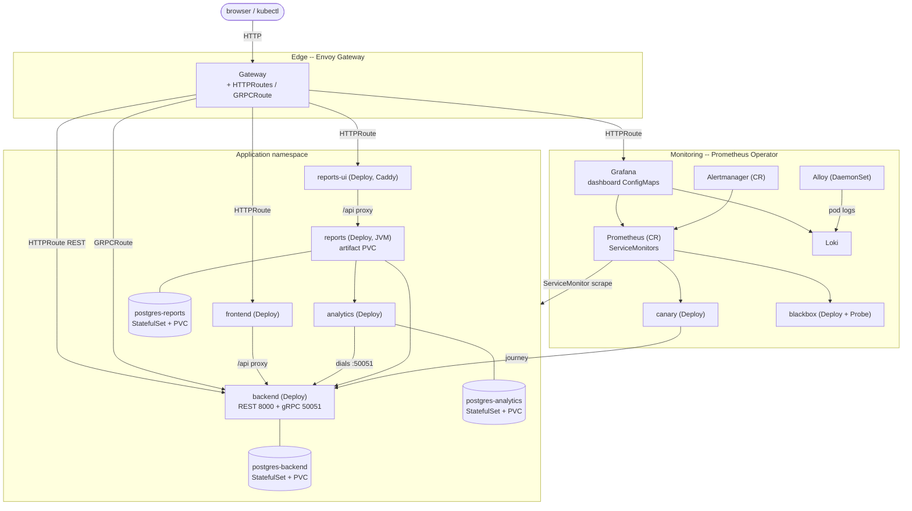

# RFC-0003: Kubernetes on Kind -- a deployment and operability platform

- **Status:** Proposed
- **Author:** vovin
- **Created:** 2026-07-24
- **Relationship to prior RFCs:** RFC-0001 (the polyglot platform) and
  RFC-0002 (the reports UI) are **immutable**. Their services, decisions, and
  scope freezes stand untouched. This RFC adds a **new deployment target** for
  the system they built; it changes no service's code or contract. It is not
  the capstone -- the capstone is authentication (a future **RFC-0004**) that
  rides on the platform this RFC stands up.

## 1. Summary

RFC-0001 and RFC-0002 built the system: five runtimes (Python, JS, Go, Rust,
Kotlin/JVM), a reports UI, contract-first gRPC, shaped load, seeded history,
and a three-layer observability stack -- all deployed with Docker Compose and
its profiles (RFC-0001 D10, ADR-0008). Compose is a fine local runtime and
stays. What the repo does **not** yet teach is how the same system runs on the
platform every one of these students will actually operate: **Kubernetes**.

This RFC adds a second, production-like deployment target: the full stack on a
local **Kubernetes** cluster via **Kind** (Kubernetes-in-Docker), packaged
with **Helm** and fronted by the **Gateway API** through **Envoy Gateway**.
The organizing idea is that RFC-0001's D6 uniform service contract
(`/healthz`, `/readyz`, `/metrics`, structured logs) was designed for exactly
this moment: `/healthz` becomes a `livenessProbe`, `/readyz` a
`readinessProbe`, `/metrics` a `ServiceMonitor`, and the five-runtime
uniformity collapses into **one Helm library chart** every service imports.
The **one documented exception is the nginx `frontend`** (a static SPA
server), which -- exactly as ADR-0013 records -- exposes none of `/healthz`,
`/readyz`, or `/metrics`; the library chart makes those probes and the
ServiceMonitor **opt-out-able** so the frontend imports the chart without
faking a contract it never met. That is not a wart: it is the same
nginx-vs-Caddy D6 contrast the repo already teaches (RFC-0002, ADR-0013),
where the Caddy `reports-ui` meets D6 and the nginx `frontend` does not, now
made visible in Kubernetes. The compose-vs-Kubernetes contrast is a
first-class exhibit, the same pedagogy as the nginx-vs-Caddy and Rust-vs-JVM
contrasts already in the repo: two deployment models for one system, and the
difference is the lesson.

No new runtime, no new service, no change to any RFC-0001/0002 contract. This
is a **deployment and operability** platform, delivered in five PRs behind the
same stop-rules, CI parity, and docs-ship discipline as everything else here.

## 2. Motivation

- Compose teaches process supervision and a private network; it does not
  teach the primitives students meet on the job: Deployments and their
  rollout/rollback, readiness gating real traffic, Services and cluster DNS,
  the Gateway/edge, StatefulSets and PVCs, ConfigMaps and Secrets, and an
  operator reconciling desired state. A DevOps teaching platform that stops at
  compose stops one step short of where the work happens.
- The D6 uniform contract (ADR-0004) was built "for this moment" and has never
  been cashed in. On Kubernetes its payoff is direct and
  visible, each D6 output mapping to its own native mechanism with no
  per-service special-casing (bar the one documented nginx exception):
  `/healthz` and `/readyz` become the liveness and readiness probes,
  `/metrics` becomes a Prometheus scrape target, and the structured logs are
  collected by the logging stack (Alloy to Loki).
  Making that payoff concrete is
  the single strongest argument this repo can make for why D6 was worth its
  fixed scaffolding cost.
- The system is the textbook case for the Kubernetes edge: one request path
  crosses frontend -> backend (REST **and** gRPC) -> analytics -> reports,
  three Postgres instances need stable identity and storage, and the JVM
  reports service is the canonical "container memory limit vs runtime heap"
  cautionary tale. These are the exhibits a Kubernetes chapter exists to show.
- RFC-0004 (authentication) needs an edge to attach identity to. Standing up a
  Gateway API edge now, via Envoy Gateway, puts the exact hook -- an Envoy
  `SecurityPolicy` doing OIDC at the edge -- one RFC away, instead of a
  from-scratch build later.

## 3. Goals

- Run the **entire** RFC-0001/0002 stack on a local multi-node Kubernetes
  cluster (Kind), reachable through a single Gateway, with `make kind-up` /
  `make kind-deploy` / `make kind-down` beside the existing compose targets.
- Package every service with **one shared Helm library chart** that encodes the
  D6 service shape (Deployment + Service + probes + resources + ServiceMonitor),
  imported by thin per-service charts under an umbrella, selected by
  per-profile values overlays that mirror the compose profiles exactly.
- Turn the D6 contract into Kubernetes primitives: `/healthz` ->
  `livenessProbe`, `/readyz` -> `readinessProbe`, gRPC health for
  `backend:50051`, `/metrics` -> `ServiceMonitor`.
- Move observability to its Kubernetes-native form: Prometheus Operator
  (kube-prometheus-stack) with per-service ServiceMonitors, Grafana dashboards
  as ConfigMaps, Loki with Alloy as a DaemonSet.
- Size requests/limits from the **measured** runtime footprint, and make the
  JVM `MaxRAMPercentage`-vs-container-limit interaction an explicit, documented
  exhibit.
- Keep CI honest and D12-consistent: a fast per-PR `helm lint` +
  `helm template | kubeconform` gate (no cluster), and a heavier
  Kind-in-CI end-to-end run nightly.

## 4. Non-goals (this RFC)

- **Authentication / authorization** -- that is RFC-0004, the capstone. This
  RFC only builds the edge it will attach to (Section 10).
- **A managed/production cluster** (EKS/GKE/AKS), cloud load balancers, real
  DNS, or TLS from a public CA. Kind is a local, throwaway, teaching cluster;
  the manifests are written to be portable, but running them on a paid cluster
  is out of scope.
- **Retiring compose.** Compose stays as the fast local path (DK10); this adds
  a second target, it does not replace the first.
- **A service mesh** (Istio/Linkerd), autoscaling (HPA/VPA), GitOps
  (Argo/Flux), or cluster policy engines (Kyverno/Gatekeeper). Each is a
  plausible later RFC; none is needed to teach the core primitives, and each
  would blow the RAM budget (Section 9). Noted as future work (Section 10).
- Any change to a service's code, its Dockerfile's contract, `proto/`,
  `loadprofile/`, or an accepted RFC/ADR (Hard rules 4, 5).

## 5. Decisions

Each decision is a candidate for extraction into a standalone ADR
(Section 11). Decisions are numbered **DK** (Kubernetes) to keep them distinct
from RFC-0001's D-series and RFC-0002's D-series in cross-references.

### DK1. Kubernetes locally on Kind, multi-node, pinned

The cluster is **Kind** (Kubernetes-in-Docker): a pinned `kind` binary and a
digest-pinned node image, configured as **multi-node** -- one control-plane
plus two workers -- so that scheduling, node affinity, and "which node is my
pod on" are real rather than degenerate.

- Rationale: Kind runs upstream Kubernetes components in Docker containers, so
  it is the **closest local thing to a real cluster** (real kubelet, real
  control plane, conformance-grade); it is the standard substrate for
  Kubernetes's own conformance runs; and it is the most CI-friendly option
  (`kind create cluster` in a GitHub Actions job, no nested-virtualization
  requirement). Multi-node makes the scheduler's decisions observable, which is
  the point of teaching them. The node image is digest-pinned exactly like
  every other base image in the repo (RFC-0001 D12).
- Rejected -- **minikube**: heavier, VM-oriented by default, and its driver
  matrix (hyperkit/kvm/docker) is an extra variable to teach around; slower and
  fiddlier in CI than Kind's plain Docker containers.
- Rejected -- **k3d / k3s**: k3s is a lightweight distribution that **swaps
  upstream components** (its own embedded etcd/SQLite, Traefik, servicelb,
  Klipper) for lighter ones. Lower RAM, but it teaches k3s's substitutions
  rather than upstream Kubernetes; a teaching platform should show the thing
  students will actually operate. Noted as a documented lighter-weight fallback
  for the most constrained laptops (Section 9), not the default.

### DK2. Helm packaging: a shared library chart under an umbrella

Packaging is **Helm**, structured as a **library chart** plus thin
per-service application charts plus one umbrella chart, with per-profile
**values overlays**.

- The library chart encodes the **D6 service shape once**: a Deployment, a
  Service, probes wired from `/healthz` (liveness) and `/readyz` (readiness),
  resource requests/limits, and a ServiceMonitor for `/metrics`. Each
  per-service chart is a few lines of values -- image, ports, env, its resource
  numbers -- that instantiate the library template. This is the **Kubernetes
  expression of the D6 uniform contract** (ADR-0004): D6 said "every service
  ships the same shape"; the library chart is that sentence made executable, so
  the uniformity is enforced by templating, not by five copies staying in sync.
  The HTTP `/healthz`+`/readyz` probes and the `/metrics` ServiceMonitor are
  **per-service opt-out** flags on the template, defaulting on: the single
  documented opt-out is the nginx `frontend` (DK4), which meets no part of the
  D6 endpoint contract (ADR-0013). Opt-out is a named exception, not a hole --
  every service that *does* meet D6 gets the wiring for free.
- The umbrella chart pulls the per-service charts as dependencies; **values
  overlays mirror the compose profiles exactly** -- `core`, `+analytics`,
  `+reports`, `+reports-ui`, `+synthetic`, `+load` -- so the runtime-selection
  mental model is identical across both deployment targets (RFC-0001 D10).
- Rejected -- **raw manifests + Kustomize**: Kustomize is excellent for
  overlaying variants, but it has no equivalent of a library chart's
  parameterized template reuse, so the D6 shape would be duplicated (or
  patched) across services -- exactly the DRY loss the library chart exists to
  prevent. The five-runtime uniformity is the thing being packaged; Helm's
  library chart packages it best.
- Rejected -- **per-service copy-pasted manifests**: the anti-pattern D6 was
  written to kill; five near-identical Deployment specs drift the moment one is
  edited alone.

### DK3. Edge via the Gateway API, implemented by Envoy Gateway

External access is the **Gateway API** (the CRD-based successor to Ingress),
implemented by **Envoy Gateway**: one `Gateway` resource plus `HTTPRoute`s for
`frontend`, `reports-ui`, the backend REST API, and Grafana, and a
`GRPCRoute` for the backend's gRPC `ItemService`. This replaces compose's
host-port publishing.

- Rationale: the Gateway API is the **modern, role-oriented standard**
  (infra-owned `Gateway` vs app-owned routes) that is superseding Ingress
  across the ecosystem; teaching it teaches where Kubernetes networking is
  going, not where it was. Envoy Gateway is a CNCF implementation built on
  Envoy, and -- decisively for this repo's arc -- Envoy's `SecurityPolicy`
  gives **edge OIDC** directly, which is the exact hook RFC-0004 needs
  (Section 10). It also finally exercises the "gRPC through an L7 edge" lesson
  RFC-0001 flagged as out of scope under compose (RFC-0001 Section 11 risks):
  `GRPCRoute` is the L7-aware answer.
- Rejected -- **ingress-nginx / raw Ingress**: Ingress is the older API; its
  annotation-driven feature sprawl is the very fragmentation the Gateway API
  was designed to replace, and it has no first-class gRPC route type. Choosing
  it would teach the legacy shape.
- Rejected -- **NodePort / port-forward only**: enough to reach a pod, but it
  teaches none of the edge routing, host-based virtual routing, or the
  OIDC-attachment point that is half the reason to do this.

### DK4. Probes wired straight from the D6 contract

Every **D6-compliant** service's `livenessProbe` targets `/healthz` and its
`readinessProbe` targets `/readyz`; the backend additionally gets a gRPC
`livenessProbe` against the gRPC Health Checking Protocol on `:50051`.

- Rationale: this is the **payoff of D6** made mechanical. Because every
  service that meets D6 exposes the same two endpoints with the same liveness /
  readiness split (ADR-0004), the library chart wires probes uniformly from a
  single template -- the JVM's slow start is handled by a
  `startupProbe` / `initialDelaySeconds` on the same `/readyz`, not by a
  different mechanism. Readiness gating is what makes a rolling update
  zero-downtime, so the split RFC-0001 built for its own sake now earns its
  keep in traffic.
- **The one documented exception: the nginx `frontend`.** As ADR-0013 records,
  the static SPA server exposes no `/healthz`, `/readyz`, or `/metrics` -- and
  because nginx's SPA fallback (`try_files ... /index.html`) answers *any* path
  with `index.html`, a `GET /healthz` probe would return 200 with the app shell
  and pass **without signal**: a vacuous probe worse than none. So the frontend
  **opts out** of the HTTP probes (DK2) and takes an honest liveness instead --
  a TCP-socket check on `:80` (or a `GET /` that admits it is only confirming
  the static server answers), never a fake `/healthz`. This is the exact
  nginx-vs-Caddy D6 contrast from RFC-0002/ADR-0013 surfacing in Kubernetes:
  Caddy `reports-ui` meets D6 and probes from `/healthz`+`/readyz`; nginx
  `frontend` does not, and the chart is honest about it.
- Rejected -- **TCP-socket or `exec` probes**: a TCP probe says the port is
  open, not that the app is ready (the JVM's whole lesson); an `exec` probe
  reruns logic the HTTP endpoint already encodes. The HTTP/gRPC endpoints exist
  precisely so the probe is a thin GET.

### DK5. Resource requests/limits from the measured footprint

Every workload declares CPU/memory **requests and limits seeded from the
service's measured runtime footprint**, not from guesses.

- Measured baseline: the **JVM `reports` service is the largest single
  consumer at ~400 MiB**, and the whole compose application stack measures
  **~1.6 GiB** at rest. Those numbers set the initial requests/limits, refined
  once running under Kind.
- The JVM gets an **explicit, documented exhibit**: a container memory *limit*
  alone does not bound the JVM heap -- the JVM must be told about the limit
  (`-XX:MaxRAMPercentage`, container-awareness) or it sizes its heap against
  the *node's* memory and gets OOM-killed by the kubelet at the limit. This
  container-limit-vs-heap interaction is one of the most common real-world
  Kubernetes-JVM incidents and is called out in the reports chart's values and
  the k8s runbook as a first-class lesson, continuous with RFC-0001 D2's
  "heap sizing vs container limits".
- Rationale: requests drive scheduling and limits drive eviction/OOM;
  teaching them with real numbers (and one deliberate failure mode) is the
  point. Under-requesting starves; over-requesting fails to schedule on a small
  Kind node -- both are visible on this cluster.
- Rejected -- **no requests/limits (BestEffort QoS)**: the easy path, but it
  hides scheduling and eviction entirely and guarantees the JVM misbehaves
  invisibly; it teaches the opposite of the lesson.

### DK6. Kubernetes-native observability

Observability moves from static compose config to its Kubernetes-native form:

- **Prometheus Operator** (via the **kube-prometheus-stack** chart) runs
  Prometheus, Alertmanager, and Grafana; **per-service ServiceMonitors** select
  each `/metrics` endpoint, **retiring the static `prometheus.yml` scrape
  jobs** -- discovery is now label-driven, the Kubernetes-native pattern.
- **Grafana dashboards ship as ConfigMaps** (the operator's sidecar loads any
  ConfigMap with the dashboard label), replacing file provisioning; the same
  JSON dashboards from `observability/grafana/dashboards/` are carried over.
- **Loki** stays; **Alloy runs as a DaemonSet**, tailing pod logs on every
  node via the Kubernetes service-discovery pattern rather than mounting the
  Docker socket. `cadvisor` and `postgres_exporter` are reconsidered against
  their Kubernetes-native equivalents: the **kubelet already exposes cAdvisor
  container metrics** and kube-prometheus-stack ships node-exporter, so the
  standalone `cadvisor` container is retired on Kubernetes (a documented
  "the platform already gives you this" lesson); `postgres_exporter` stays as a
  sidecar/Deployment with its own ServiceMonitor.
- Rationale: the compose stack teaches static scrape config; Kubernetes
  teaches **label-based service discovery and operators reconciling
  monitoring**, which is how observability is actually run on Kubernetes. The
  contrast (static `prometheus.yml` vs ServiceMonitor CRs) is itself the
  exhibit.
- Rejected -- **lift the static `prometheus.yml` into a ConfigMap verbatim**:
  runs Prometheus on Kubernetes while teaching none of the Kubernetes-native
  monitoring model; a missed lesson dressed up as a port.

### DK7. Postgres as StatefulSets with PVCs; artifacts on a PVC

The three Postgres instances (backend / analytics / reports) run as
**StatefulSets** with **PersistentVolumeClaims** and headless Services; the
reports artifact volume becomes a **PVC**.

- Rationale: stateful workloads with stable network identity and durable
  per-replica storage are *the* StatefulSet use case, and "service owns its
  store" (RFC-0001 D1) maps cleanly to three independent StatefulSets, each
  with its own PVC -- the ownership stays visible in the topology exactly as it
  is in compose. The reports artifacts (never BLOBs-in-Postgres, RFC-0001 D2)
  need a `ReadWriteOnce` PVC, teaching the volume-lifecycle-vs-pod-lifecycle
  distinction.
- Rejected -- **Deployments with `emptyDir`**: data dies with the pod; a
  database on ephemeral storage is a teaching anti-pattern. Rejected --
  **an in-cluster Postgres operator** (CloudNativePG, Zalando): excellent in
  production, but it adds an operator and CRDs to learn that are orthogonal to
  the StatefulSet/PVC primitives this RFC is here to teach, and it costs RAM.
  Noted as future work (Section 10).

### DK8. Config via ConfigMaps, credentials via Secrets (still demo-grade)

Non-secret configuration (upstream URLs, ports, `DEMO_TIME_SCALE`, profile
flags) moves into **ConfigMaps**; credentials (Postgres passwords, the Grafana
admin password) move into **Secrets**.

- Rationale: the ConfigMap/Secret split is a core Kubernetes primitive and the
  natural home for what compose passes as environment variables. It also stages
  RFC-0004: the moment there is a real identity provider, these Secrets are
  where its wiring lands.
- Honesty, stated plainly (continuous with ADR-0011 and the Rejected Finding
  in AGENTS.md): these Secrets are **still demo-grade** -- base64, checked-in
  defaults, no external secret store, no encryption-at-rest configured on the
  Kind cluster. A Kubernetes `Secret` is not a secret-management solution; it
  is a distribution mechanism. Real secret management (external store, sealed/
  external secrets, KMS) belongs to the authentication capstone, **RFC-0004**
  (originally deferred in RFC-0001 Section 10), and is forward-referenced
  there, not cargo-culted here.
- Rejected -- **plaintext env in the Deployment spec**: skips the primitive
  entirely and would put the demo passwords in the Deployment manifest instead
  of a Secret -- worse posture *and* a missed lesson.

### DK9. CI: fast per-PR template validation, heavy Kind e2e nightly

CI splits along cost, D12-consistent with the existing pipeline:

- **Per-PR (fast, no cluster):** `helm lint` on every chart, then
  `helm template <umbrella> | kubeconform --strict` to validate the rendered
  manifests against the Kubernetes API schemas. Fast enough to gate every PR,
  needs no running cluster. **First thing the PR-2 author hits:** kubeconform
  only knows the core k8s schemas, so it will not validate this stack's CRs --
  Gateway API (`HTTPRoute`/`GRPCRoute`/`Gateway`), Prometheus Operator
  (`ServiceMonitor`/`Probe`), Envoy Gateway -- unless the gate passes explicit
  CRD JSON-schema `-schema-location`s for each. The lazy `--ignore-missing-
  schemas` escape hatch instead **skips exactly those CRs** -- the interesting
  ones -- so it is rejected; the per-PR gate must supply the CRD schema
  locations so the CRs are actually checked, not silently passed.
- **Nightly (heavy, real cluster):** a Kind-in-CI end-to-end job --
  `kind create cluster` -> `helm install` the umbrella -> smoke the Gateway
  routes and service health -> `kind delete cluster`. This mirrors the existing
  **nightly JVM `full`-profile** workflow (RFC-0001 D12): the expensive,
  Docker-heavy path runs on a schedule, not on every push.
- The new toolchains -- **kind, kubectl, helm, kubeconform** -- are pinned in
  `.mise.toml` and enforced by the toolchain **drift gate** (RFC-0001 D14,
  ADR-0012); the implementation PRs wire them in.
- Rationale: `make ci` parity (RFC-0001 D12) holds -- the per-PR helm/
  kubeconform checks run identically locally and in CI. Splitting fast-lint
  from a real-cluster e2e keeps per-PR feedback quick while still exercising a
  genuine `helm install` before merge to `main` each night.
- Rejected -- **spin up Kind on every PR**: minutes of cluster bring-up per
  push for a teaching repo is disproportionate; the schema-level render check
  catches the overwhelming majority of chart mistakes at a fraction of the cost.

### DK10. `make kind-*` beside compose; compose retained as the fast path

New Make targets -- `make kind-up` (create the cluster + install the Gateway/
Operator prerequisites), `make kind-deploy` (helm install the app, profile-
selectable), `make kind-down` (delete the cluster) -- sit **beside** the
existing `make up` / `make up-full`. **Compose is retained**, deliberately.

- Rationale: compose is the **fast local path** (seconds to a running stack,
  tiny RAM); Kind is the **production-like path** (real Kubernetes primitives,
  more RAM, slower). Keeping both is a **deliberate two-deployment-model
  contrast** -- the same pedagogy as nginx-vs-Caddy (RFC-0002) and Rust-vs-JVM
  (RFC-0001 Section 7): one system, two ways to run it, and the diff between
  them is the teaching material. A student runs compose to iterate and Kind to
  learn Kubernetes.
- Rejected -- **replace compose with Kind**: throws away the fast iteration
  loop and the RAM-cheap entry point that lets a constrained laptop run the
  stack at all; and it would delete the contrast that makes both valuable.

## 6. Target architecture

The compose services and profiles (RFC-0001 D10, RFC-0002 D7) map onto
Kubernetes workloads one-to-one. Profiles become Helm values overlays; the
mapping is intentionally mechanical so the two deployment models stay legible
against each other.

| Compose service (profile) | Kubernetes workload | Edge route |
| --- | --- | --- |
| api / backend (core) | Deployment + Service (8000 REST, 50051 gRPC) + ServiceMonitor | HTTPRoute (REST), GRPCRoute (gRPC) |
| web / frontend (core) | Deployment + Service | HTTPRoute |
| db / postgres-backend (core) | StatefulSet + PVC + headless Service | -- |
| postgres_exporter (core) | Deployment + Service + ServiceMonitor | -- |
| prometheus (core) | kube-prometheus-stack (Prometheus CR, Operator) | -- |
| alertmanager (core) | kube-prometheus-stack (Alertmanager CR) | -- |
| grafana (core) | kube-prometheus-stack Grafana + dashboard ConfigMaps | HTTPRoute |
| loki (core) | Deployment/StatefulSet + Service | -- |
| alloy (core) | DaemonSet (per-node pod log tail) | -- |
| cadvisor (core) | retired -- kubelet cAdvisor + node-exporter (DK6) | -- |
| mailpit (core) | Deployment + Service | -- |
| postgres-analytics (+analytics) | StatefulSet + PVC + headless Service | -- |
| analytics (+analytics) | Deployment + Service + ServiceMonitor | -- |
| postgres-reports (+reports) | StatefulSet + PVC + headless Service | -- |
| reports (+reports) | Deployment + Service + ServiceMonitor + artifact PVC | -- |
| reports-ui (+reports-ui) | Deployment + Service + ServiceMonitor | HTTPRoute |
| blackbox (+synthetic) | Deployment + Service + Probe CR | -- |
| canary (+synthetic) | Deployment + Service + ServiceMonitor | -- |
| loadgen (+load) | Deployment (long-running k6) | -- |

Two things in this mapping are deliberate, not omissions. First, the nginx
`frontend` row carries **no ServiceMonitor** where every other app service
does: it exposes no `/metrics` (ADR-0013, DK4), so there is nothing to scrape
and the library chart's ServiceMonitor is opted out (DK2) -- the single
documented D6 exception, surfaced here as a blank cell rather than a
fabricated scrape target. Second, the SPAs **keep their in-pod reverse
proxy**: both the nginx `frontend` and the Caddy `reports-ui` continue to
proxy `/api/*` to their backend inside the pod (no application-code change is
a non-goal, Section 4), which is why both show an `/api proxy` arrow in the
diagram below. The backend's REST `HTTPRoute` and `GRPCRoute` at the Gateway
are **additive** -- a direct edge path for non-SPA REST clients and for gRPC --
not a replacement for the SPAs' same-origin proxy path.

## 7. Delivery plan

Same stop-rules as all repo work: each PR is independently reviewable, ships
its own docs and CI, and mixes no mechanical with logic changes (Hard rules
10, 11). This PR (**PR-1**) is design only -- no manifests, no charts.

| PR | Deliverable |
| --- | --- |
| PR-1 (this) | This RFC + ADR-0014--0018 + README intro refresh (the polyglot platform is built; the next arc is this deployment platform, then RFC-0004). No manifests. |
| PR-2 | Helm **library chart** (the D6 shape) + thin per-service charts + umbrella chart + per-profile values overlays; per-PR CI gate: `helm lint` + `helm template \| kubeconform`. No cluster required. |
| PR-3 | **Kind** cluster (multi-node config, digest-pinned node image, `.mise.toml` pins for kind/kubectl/helm/kubeconform + drift gate) + `make kind-up/kind-deploy/kind-down`; deploy the app services (Deployments, probes from D6, resources from measured footprint, Postgres StatefulSets + PVCs, ConfigMaps/Secrets) + **Envoy Gateway** + Gateway/HTTPRoutes/GRPCRoute; local bring-up green. |
| PR-4 | **Kubernetes-native observability**: kube-prometheus-stack (Operator) + per-service ServiceMonitors (retire static scrape jobs), Grafana dashboards as ConfigMaps, Loki + Alloy DaemonSet, blackbox Probe. |
| PR-5 | **Kind e2e nightly** workflow (`kind create` -> `helm install` -> smoke -> `kind delete`) + docs + a Kubernetes **runbook** (bring-up, the JVM-limit exhibit, RAM guidance, teardown). |

Splitting packaging (PR-2, no cluster) from the cluster itself (PR-3) keeps the
chart review a pure templating exercise against `kubeconform`, and keeps the
cluster PR about Kubernetes wiring against a settled chart -- each independently
demoable.

## 8. Acceptance criteria

- **PR-1 (this):** this RFC and ADR-0014--0018 lint clean (markdownlint,
  ASCII gate); every ADR number is new; no edit to RFC-0001/0002 or any
  accepted ADR; the README no longer describes the platform as "evolving from a
  two-service baseline" and points at RFC-0003 for the deployment arc.
- **PR-2:** `helm lint` passes on every chart; `helm template` on the umbrella
  with each profile overlay renders, and the output passes
  `kubeconform --strict`; the library chart is imported by every per-service
  chart (no duplicated Deployment/Service/probe blocks).
- **PR-3:** `make kind-up && make kind-deploy` brings the `core` profile up
  green on a multi-node Kind cluster; every pod passes its `/healthz` liveness
  and `/readyz` readiness probes (backend also passes its gRPC health probe);
  the three Postgres StatefulSets bind PVCs; the frontend, reports-ui, backend
  REST, backend gRPC, and Grafana are reachable through the Envoy Gateway;
  `make kind-down` deletes the cluster cleanly.
- **PR-4:** Prometheus (Operator) discovers every metrics-bearing (D6-compliant)
  service via its ServiceMonitor with the static scrape jobs removed -- the
  nginx `frontend` is the one documented exception (no `/metrics`, so no
  ServiceMonitor); Grafana loads its dashboards from ConfigMaps; Alloy tails
  pod logs into Loki, node-locally, from every node.
- **PR-5:** the nightly Kind e2e workflow creates a cluster, `helm install`s
  the stack, smokes the Gateway routes and service health, and tears the
  cluster down; the k8s runbook documents bring-up, the JVM container-limit
  exhibit, RAM guidance, and teardown.

## 9. Risks and mitigations

| Risk | Mitigation |
| --- | --- |
| **RAM.** Kind control-plane + kube-prometheus-stack + the full app stack + Envoy can reach ~6-10 GB, vs the ~1.6 GB compose stack -- past many student laptops | A trimmed **dev values** overlay (reduced replicas/resources, retention, scrape frequency); the `core` overlay as the default small footprint; a documented **requirements bump** for the Kind path with `make doctor` gating available RAM (RFC-0001 D14); k3s noted as a lighter fallback (DK1). A plain-Prometheus (no Operator) path is **explicitly out of scope and unsupported** -- it does not satisfy this RFC's observability contract (ServiceMonitor-driven discovery, DK6); the supported RAM relief is the trimmed dev overlay and the `core` overlay, not dropping the Operator |
| Two deployment models read as duplication / drift | Framed as a deliberate contrast (DK10); the Helm values overlays mirror the compose profiles one-to-one (DK2, Section 6) so the mental model is shared, not forked |
| Helm chart sprawl (library + per-service + umbrella) | The library chart is the point -- per-service charts are a few values each (DK2); `helm lint` + `kubeconform` gate every PR (DK9) |
| JVM OOM-killed at the container limit | Made an **explicit exhibit** (DK5): `MaxRAMPercentage`/container-awareness set in the reports chart values, documented in the k8s runbook |
| Kind-specific behavior (no cloud LoadBalancer, local image loading) taught as if universal | Documented as Kind-isms in the runbook; Gateway reached via a documented local method (port-forward / `kind` extra-port-mappings), called out as the local substitute for a cloud LB |
| Nightly Kind e2e flakes on cluster bring-up | Bring-up is nightly, not per-PR (DK9); per-PR relies on the deterministic `kubeconform` render check; the e2e retries cluster create and surfaces logs on failure |
| Scope creep (mesh, HPA, GitOps, Postgres operator) | Explicit non-goals (Section 4) and future work (Section 10); each is a separate RFC, none needed for the core primitives |

## 10. Relationship to prior RFCs and the RFC-0004 capstone

- RFC-0001 and RFC-0002 remain **immutable and authoritative** for the system.
  This RFC neither edits nor reinterprets any of their decisions; it adds a
  deployment target for the system they define.
- **No new runtime, no new service.** The five-runtime count (RFC-0001) and
  the reports-ui exhibit (RFC-0002) are unchanged; this RFC changes only *how
  and where* they run.
- It **cashes in** RFC-0001's forward-looking decisions: D6 (the uniform
  contract) becomes probes + ServiceMonitors (DK4, DK6); D10 (compose profiles
  - graceful degradation) becomes Helm values overlays (DK2); D2's
  container-awareness/JVM concerns become the DK5 exhibit; and RFC-0001's own
  deferred "Kubernetes deployment under `deploy/k8s/`" (RFC-0001 Section 10)
  is what this RFC delivers.
- **The capstone is a future RFC-0004: authentication and authorization**, via
  a provider-agnostic open-source OIDC provider, riding on **this** platform.
  The edge built here is the hook: an Envoy Gateway `SecurityPolicy` performing
  **edge OIDC** in front of the HTTPRoutes (DK3), with the identity provider's
  wiring landing in the Secrets this RFC introduces (DK8). RFC-0003 stops at
  the unauthenticated edge on purpose -- authentication is the finale, and it
  needs a platform to stand on. This RFC is that platform.

## 11. ADRs to extract

Extracted in this PR (Status: Accepted, next after ADR-0013):

1. **ADR-0014:** Kubernetes on Kind as the local deployment target (DK1).
2. **ADR-0015:** Helm library-chart + umbrella packaging as the k8s expression
   of the D6 uniform contract (DK2).
3. **ADR-0016:** Gateway API via Envoy Gateway for the edge (DK3).
4. **ADR-0017:** Kubernetes-native observability -- Prometheus Operator +
   ServiceMonitors (DK6).
5. **ADR-0018:** Stateful workloads as StatefulSets with PVCs (DK7).

Durable but folded into the above rather than given their own ADR: probes-from-
D6 (DK4, a direct consequence of ADR-0004), resources-from-measured-footprint
and the JVM-limit exhibit (DK5, documented in the reports chart + runbook),
ConfigMaps/Secrets demo-grade posture (DK8, continuous with ADR-0011), the CI
split (DK9, continuous with ADR-0009/ADR-0012), and the `make kind-*` two-model
contrast (DK10). These are recorded here and in the implementation PRs; they do
not each warrant a standalone durable decision.
